# E-Commerce Data Warehouse - Entity Relationship Diagram

## ERD Diagram (Mermaid)

```mermaid
erDiagram

    %% ===== DIMENSION TABLES (no FK dependencies) =====
    dim_dates {
        NUMBER date_key PK
        DATE full_date
        NUMBER day_of_week
        VARCHAR day_name
        NUMBER day_of_month
        NUMBER day_of_year
        NUMBER week_of_year
        NUMBER month_number
        VARCHAR month_name
        VARCHAR month_abbr
        NUMBER quarter_number
        NUMBER calendar_year
        BOOLEAN is_weekend
        BOOLEAN is_holiday
        NUMBER fiscal_year
        NUMBER fiscal_quarter
    }

    dim_time {
        NUMBER time_key PK
        TIME time_value
        NUMBER hour_24
        NUMBER minute_of_hour
        NUMBER second_of_minute
        VARCHAR am_pm
        NUMBER hour_12
        VARCHAR day_part
        BOOLEAN is_business_hours
        BOOLEAN is_peak_shopping
    }

    dim_channels {
        NUMBER channel_key PK
        VARCHAR channel_id
        VARCHAR channel_name
        VARCHAR channel_code
        VARCHAR channel_type
        VARCHAR description
        BOOLEAN is_active
        TIMESTAMP_NTZ created_at
        TIMESTAMP_NTZ updated_at
    }

    dim_stores {
        NUMBER store_key PK
        VARCHAR store_id
        VARCHAR store_name
        VARCHAR store_type
        VARCHAR address_line1
        VARCHAR address_line2
        VARCHAR city
        VARCHAR state
        VARCHAR postal_code
        VARCHAR country
        VARCHAR region
        VARCHAR phone_number
        VARCHAR email
        DATE opening_date
        DATE closing_date
        NUMBER square_footage
        BOOLEAN is_active
        NUMBER latitude
        NUMBER longitude
        TIMESTAMP_NTZ created_at
        TIMESTAMP_NTZ updated_at
    }

    dim_promotions {
        NUMBER promotion_key PK
        VARCHAR promotion_id
        VARCHAR promotion_name
        VARCHAR promotion_type
        VARCHAR promotion_code
        DATE start_date
        DATE end_date
        NUMBER discount_percentage
        NUMBER discount_amount
        NUMBER min_purchase_amount
        NUMBER max_discount_amount
        BOOLEAN is_stackable
        BOOLEAN is_active
        TIMESTAMP_NTZ created_at
        TIMESTAMP_NTZ updated_at
    }

    dim_payment_methods {
        NUMBER payment_method_key PK
        VARCHAR payment_method_id
        VARCHAR payment_method_name
        VARCHAR payment_method_code
        VARCHAR payment_type
        BOOLEAN is_active
        TIMESTAMP_NTZ created_at
        TIMESTAMP_NTZ updated_at
    }

    dim_shipping_methods {
        NUMBER shipping_method_key PK
        VARCHAR shipping_method_id
        VARCHAR shipping_method_name
        VARCHAR shipping_method_code
        VARCHAR carrier
        NUMBER estimated_days_min
        NUMBER estimated_days_max
        NUMBER base_cost
        BOOLEAN is_active
        TIMESTAMP_NTZ created_at
        TIMESTAMP_NTZ updated_at
    }

    dim_product_categories {
        NUMBER category_key PK
        VARCHAR category_id
        VARCHAR category_name
        NUMBER category_level
        NUMBER parent_category_key
        VARCHAR category_path
        BOOLEAN is_active
        TIMESTAMP_NTZ created_at
        TIMESTAMP_NTZ updated_at
    }

    dim_customer_segments {
        NUMBER segment_key PK
        VARCHAR segment_id
        VARCHAR segment_name
        VARCHAR segment_code
        VARCHAR description
        NUMBER min_lifetime_value
        NUMBER max_lifetime_value
        BOOLEAN is_active
        TIMESTAMP_NTZ created_at
        TIMESTAMP_NTZ updated_at
    }

    dim_loyalty_tiers {
        NUMBER tier_key PK
        VARCHAR tier_id
        VARCHAR tier_name
        NUMBER min_points
        NUMBER max_points
        VARCHAR description
        BOOLEAN is_active
        TIMESTAMP_NTZ created_at
        TIMESTAMP_NTZ updated_at
    }

    dim_accounts {
        NUMBER account_key PK
        VARCHAR account_id
        VARCHAR account_name
        VARCHAR account_type
        VARCHAR company_name
        VARCHAR tax_id
        BOOLEAN tax_exempt_status
        VARCHAR billing_address_line1
        VARCHAR billing_address_line2
        VARCHAR billing_city
        VARCHAR billing_state
        VARCHAR billing_postal_code
        VARCHAR billing_country
        VARCHAR payment_terms
        NUMBER credit_limit
        VARCHAR account_status
        VARCHAR account_tier
        DATE registration_date
        DATE closure_date
        BOOLEAN is_active
        TIMESTAMP_NTZ created_at
        TIMESTAMP_NTZ updated_at
    }

    %% ===== DIMENSION TABLES (with FK dependencies) =====
    dim_customers {
        NUMBER customer_key PK
        VARCHAR customer_id
        VARCHAR first_name
        VARCHAR last_name
        VARCHAR full_name
        VARCHAR email
        VARCHAR phone_number
        DATE birth_date
        VARCHAR gender
        NUMBER segment_key FK
        VARCHAR preferred_channel
        BOOLEAN is_active
        DATE effective_date
        DATE end_date
        BOOLEAN is_current
        TIMESTAMP_NTZ created_at
        TIMESTAMP_NTZ updated_at
        VARIANT customer_preferences
        GEOGRAPHY home_location
    }

    dim_customer_address {
        NUMBER address_key PK
        NUMBER customer_key FK
        VARCHAR address_line1
        VARCHAR address_line2
        VARCHAR city
        VARCHAR state
        VARCHAR postal_code
        VARCHAR country
        DATE registration_date
        DATE effective_date
        DATE end_date
        BOOLEAN is_current
        TIMESTAMP_NTZ created_at
        TIMESTAMP_NTZ updated_at
    }

    dim_customer_loyalty {
        NUMBER loyalty_key PK
        NUMBER customer_key FK
        BOOLEAN loyalty_program_member
        NUMBER loyalty_tier_key FK
        NUMBER loyalty_points_balance
        NUMBER lifetime_value
        NUMBER account_key FK
        DATE effective_date
        DATE end_date
        BOOLEAN is_current
        TIMESTAMP_NTZ created_at
        TIMESTAMP_NTZ updated_at
    }

    dim_products {
        NUMBER product_key PK
        VARCHAR product_id
        VARCHAR sku
        VARCHAR product_name
        VARCHAR brand
        NUMBER category_key FK
        VARCHAR description
        NUMBER unit_price
        NUMBER unit_cost
        NUMBER weight_kg
        BOOLEAN is_active
        BOOLEAN is_discontinued
        DATE effective_date
        DATE end_date
        BOOLEAN is_current
        TIMESTAMP_NTZ created_at
        TIMESTAMP_NTZ updated_at
    }

    dim_employees {
        NUMBER employee_key PK
        VARCHAR employee_id
        VARCHAR first_name
        VARCHAR last_name
        VARCHAR full_name
        VARCHAR email
        VARCHAR phone_number
        VARCHAR position
        VARCHAR department
        NUMBER store_key FK
        DATE hire_date
        DATE termination_date
        NUMBER salary
        BOOLEAN is_active
        TIMESTAMP_NTZ created_at
        TIMESTAMP_NTZ updated_at
    }

    %% ===== FACT TABLES =====
    fact_sales {
        NUMBER sale_key PK
        VARCHAR order_id
        NUMBER date_key FK
        NUMBER time_key FK
        NUMBER customer_key FK
        NUMBER store_key FK
        NUMBER channel_key FK
        NUMBER promotion_key FK
        NUMBER payment_method_key FK
        NUMBER shipping_method_key FK
        NUMBER employee_key FK
        NUMBER quantity
        NUMBER gross_amount
        NUMBER discount_amount
        NUMBER net_amount
        NUMBER tax_amount
        NUMBER shipping_amount
        NUMBER total_amount
        VARCHAR order_status
        BOOLEAN is_online
        TIMESTAMP_NTZ created_at
        ARRAY order_tags
        OBJECT shipment_metadata
    }

    fact_inventory_snapshots {
        NUMBER inventory_snapshot_key PK
        NUMBER date_key FK
        NUMBER product_key FK
        NUMBER store_key FK
        NUMBER quantity_on_hand
        NUMBER quantity_reserved
        NUMBER quantity_available
        NUMBER reorder_point
        BOOLEAN is_below_reorder_point
        NUMBER days_of_supply
        TIMESTAMP_NTZ created_at
    }

    fact_customer_interactions {
        NUMBER interaction_key PK
        VARCHAR interaction_id
        NUMBER date_key FK
        NUMBER time_key FK
        NUMBER customer_key FK
        NUMBER channel_key FK
        NUMBER store_key FK
        NUMBER employee_key FK
        NUMBER product_key FK
        NUMBER sale_key FK
        VARCHAR interaction_type
        VARCHAR device_type
        VARCHAR session_id
        VARCHAR page_url
        NUMBER duration_seconds
        BOOLEAN is_converted
        TIMESTAMP_NTZ created_at
        VARIANT event_properties
        GEOGRAPHY geo_location
        BINARY raw_payload
    }

    fact_loyalty_points {
        NUMBER loyalty_transaction_key PK
        VARCHAR transaction_id
        NUMBER date_key FK
        NUMBER time_key FK
        NUMBER customer_key FK
        NUMBER sale_key FK
        NUMBER channel_key FK
        VARCHAR transaction_type
        NUMBER points
        NUMBER points_balance_after
        VARCHAR description
        DATE expiration_date
        TIMESTAMP_NTZ created_at
    }

    %% ===== BRIDGE TABLES =====
    bridge_account_customers {
        NUMBER account_customer_key PK
        NUMBER account_key FK
        NUMBER customer_key FK
        VARCHAR role
        BOOLEAN is_primary_contact
        DATE effective_date
        DATE end_date
        BOOLEAN is_current
        TIMESTAMP_NTZ created_at
    }

    bridge_order_items {
        NUMBER order_item_key PK
        NUMBER sale_key FK
        NUMBER product_key FK
        NUMBER line_number
        NUMBER quantity
        NUMBER unit_price
        NUMBER discount_amount
        NUMBER line_total
        BOOLEAN is_gift
        VARCHAR gift_message
        TIMESTAMP_NTZ created_at
    }

    bridge_product_promotions {
        NUMBER product_promotion_key PK
        NUMBER product_key FK
        NUMBER promotion_key FK
        BOOLEAN is_featured
        NUMBER priority
        TIMESTAMP_NTZ created_at
    }

    %% ===== VIEWS (logical, derived from tables) =====
    v_purchase {
        NUMBER sale_key
        VARCHAR order_id
        NUMBER order_item_key
        NUMBER line_number
        NUMBER product_key FK
        NUMBER customer_key FK
        VARCHAR customer_id
        VARCHAR first_name
        VARCHAR last_name
        VARCHAR email
        VARCHAR loyalty_tier
        DATE order_date
        NUMBER line_quantity
        NUMBER unit_price
        NUMBER line_total
        NUMBER total_amount
        VARCHAR order_status
        VARCHAR channel_name
        VARCHAR store_name
        VARCHAR promotion_name
        VARCHAR payment_method_name
        VARCHAR shipping_method_name
        NUMBER points_earned
    }

    v_purchase_full {
        NUMBER sale_key
        VARCHAR order_id
        NUMBER order_item_key
        NUMBER line_number
        NUMBER customer_key FK
        NUMBER product_key FK
        VARCHAR customer_id
        VARCHAR first_name
        VARCHAR last_name
        VARCHAR loyalty_tier
        VARCHAR product_id
        VARCHAR sku
        VARCHAR product_name
        VARCHAR brand
        VARCHAR category_name
        VARCHAR category_path
        NUMBER line_quantity
        NUMBER unit_price
        NUMBER line_total
        NUMBER total_amount
        VARCHAR order_status
        VARCHAR channel_name
        VARCHAR store_name
        VARCHAR promotion_name
        NUMBER points_earned
    }

    %% ===== RELATIONSHIPS =====

    %% Dimension FK dependencies
    dim_customers ||--o{ dim_customer_segments : "segment_key"
    dim_customer_address }o--|| dim_customers : "customer_key"
    dim_customer_loyalty }o--|| dim_customers : "customer_key"
    dim_customer_loyalty }o--|| dim_accounts : "account_key"
    dim_customer_loyalty }o--o| dim_loyalty_tiers : "loyalty_tier_key"
    dim_products ||--o{ dim_product_categories : "category_key"
    dim_employees ||--o{ dim_stores : "store_key"

    %% fact_sales relationships
    fact_sales }o--|| dim_dates : "date_key"
    fact_sales }o--o| dim_time : "time_key"
    fact_sales }o--|| dim_customers : "customer_key"
    fact_sales }o--o| dim_stores : "store_key"
    fact_sales }o--|| dim_channels : "channel_key"
    fact_sales }o--o| dim_promotions : "promotion_key"
    fact_sales }o--|| dim_payment_methods : "payment_method_key"
    fact_sales }o--o| dim_shipping_methods : "shipping_method_key"
    fact_sales }o--o| dim_employees : "employee_key"

    %% fact_inventory_snapshots relationships
    fact_inventory_snapshots }o--|| dim_dates : "date_key"
    fact_inventory_snapshots }o--|| dim_products : "product_key"
    fact_inventory_snapshots }o--o| dim_stores : "store_key"

    %% fact_customer_interactions relationships
    fact_customer_interactions }o--|| dim_dates : "date_key"
    fact_customer_interactions }o--o| dim_time : "time_key"
    fact_customer_interactions }o--|| dim_customers : "customer_key"
    fact_customer_interactions }o--|| dim_channels : "channel_key"
    fact_customer_interactions }o--o| dim_stores : "store_key"
    fact_customer_interactions }o--o| dim_employees : "employee_key"
    fact_customer_interactions }o--o| dim_products : "product_key"
    fact_customer_interactions }o--o| fact_sales : "sale_key"

    %% fact_loyalty_points relationships
    fact_loyalty_points }o--|| dim_dates : "date_key"
    fact_loyalty_points }o--o| dim_time : "time_key"
    fact_loyalty_points }o--|| dim_customers : "customer_key"
    fact_loyalty_points }o--o| fact_sales : "sale_key"
    fact_loyalty_points }o--o| dim_channels : "channel_key"

    %% Bridge table relationships
    bridge_order_items }o--|| fact_sales : "sale_key"
    bridge_order_items }o--|| dim_products : "product_key"
    bridge_product_promotions }o--|| dim_products : "product_key"
    bridge_product_promotions }o--|| dim_promotions : "promotion_key"
    bridge_account_customers }o--|| dim_accounts : "account_key"
    bridge_account_customers }o--|| dim_customers : "customer_key"

    %% View relationships (many:one to dim_products)
    v_purchase }o--|| dim_products : "product_key"
    v_purchase_full }o--|| dim_products : "product_key"
```

---

## Table Relationships:

### Dimension Tables (No FK Dependencies) - 11 Tables

| Table | PK | FK | Relationship |
|-------|----|----|--------------|
| __dim_dates__ | `date_key` | None | Standalone calendar dimension. Pre-populated with date attributes (day, week, month, quarter, year, holidays). Referenced by all fact tables for time-series analysis. |
| __dim_time__ | `time_key` | None | Standalone time-of-day dimension. Enables intraday analysis (morning/afternoon/evening, business hours). Referenced by fact tables for granular timing. |
| __dim_channels__ | `channel_key` | None | Sales channel types (Web, In-Store, Mobile App, Call Center). No dependencies. |
| __dim_stores__ | `store_key` | None | Physical store locations with type, city, state, country. Parent to `dim_employees`. |
| __dim_promotions__ | `promotion_key` | None | Marketing campaigns with discount percentages and date ranges. Parent to `bridge_product_promotions`. |
| __dim_payment_methods__ | `payment_method_key` | None | Payment types (Credit Card, Apple Pay, PayPal) with processing fees. |
| __dim_shipping_methods__ | `shipping_method_key` | None | Delivery options (Standard, Express, Same Day) with carriers. |
| __dim_product_categories__ | `category_key` | None | Product hierarchy (category > subcategory). Self-referencing via `parent_category_key` for nested hierarchies. Parent to `dim_products`. |
| __dim_customer_segments__ | `segment_key` | None | Customer classification groups (High Value, Regular, New) with LTV thresholds. Parent to `dim_customers`. |
| __dim_accounts__ | `account_key` | None | Customer accounts (Individual, Household, Business, Corporate, Guest). Many customers per account (many:1). Supports B2B attributes (company name, tax ID, credit limit, payment terms). |

### Dimension Tables (With FK Dependencies) - 5 Tables

| Table | PK | FK | Relationship |
|-------|----|----|--------------|
| __dim_customers__ | `customer_key` | `segment_key` → `dim_customer_segments` | Customer identity & demographics. SCD Type 2 - tracks changes via `effective_date`, `end_date`, `is_current`. Contains name, email, phone, birth_date, gender, preferred_channel.|
| __dim_customer_address__ | `address_key` | `customer_key` → `dim_customers` | Customer addresses. SCD Type 2 - tracks address changes over time. Contains street, city, state, postal_code, country, registration_date. |
| __dim_customer_loyalty__ | `loyalty_key` | `customer_key` → `dim_customers`, `account_key` → `dim_accounts`, `loyalty_tier_key` → `dim_loyalty_tiers` | Loyalty program metrics. SCD Type 2 - tracks loyalty status changes. Contains loyalty_program_member, loyalty_points_balance, lifetime_value. |
| __dim_products__ | `product_key` | `category_key` → `dim_product_categories` | Each product belongs to one category. SCD Type 2 table - tracks price/attribute changes over time. Multiple rows per product_id possible. |
| __dim_employees__ | `employee_key` | `store_key` → `dim_stores` | Each employee works at one store. Links sales associates to physical locations. |

### Fact Tables - 4 Tables

| Table | PK | FKs | Relationship |
|-------|----|----|--------------|
| __fact_sales__ | `sale_key` | `date_key` → `dim_dates` (required) | Central fact table - the "hub" of the star schema.|
| | | `time_key` → `dim_time` (optional) | Each sale occurs at one time of day. |
| | | `customer_key` → `dim_customers` (required) | Each sale belongs to one customer. |
| | | `store_key` → `dim_stores` (optional) | Physical store location (NULL for online-only). |
| | | `channel_key` → `dim_channels` (required) | Sales channel (Web, In-Store, etc.). |
| | | `promotion_key` → `dim_promotions` (optional) | Applied promotion (NULL if no promo). |
| | | `payment_method_key` → `dim_payment_methods` (required) | How the customer paid. |
| | | `shipping_method_key` → `dim_shipping_methods` (optional) | Delivery method (NULL for pickup). |
| | | `employee_key` → `dim_employees` (optional) | Sales associate (NULL for self-service). |
| __fact_inventory_snapshots__ | `inventory_snapshot_key` | `date_key` → `dim_dates` (required) | Daily inventory levels by product/location. |
| | | `product_key` → `dim_products` (required) | Which product. |
| | | `store_key` → `dim_stores` (optional) | Which location (NULL for warehouse). |
| __fact_customer_interactions__ | `interaction_key` | `date_key` → `dim_dates` (required) | Customer touchpoints (visits, clicks, calls).|
| | | `time_key` → `dim_time` (optional) | When during the day. |
| | | `customer_key` → `dim_customers` (required) | Which customer. |
| | | `channel_key` → `dim_channels` (required) | Which channel. |
| | | `store_key` → `dim_stores` (optional) | Physical location (if applicable). |
| | | `employee_key` → `dim_employees` (optional) | Who assisted. |
| | | `product_key` → `dim_products` (optional) | Product related to interaction (if applicable). |
| | | `sale_key` → `fact_sales` (optional) | __Fact-to-fact link__ - links interaction to resulting purchase. |
| __fact_loyalty_points__ | `loyalty_transaction_key` | `date_key` → `dim_dates` (required) | Points earned/redeemed. |
| | | `time_key` → `dim_time` (optional) | When during the day. |
| | | `customer_key` → `dim_customers` (required) | Which customer. |
| | | `sale_key` → `fact_sales` (optional) | __Fact-to-fact link__ - links points to purchase that earned them. |
| | | `channel_key` → `dim_channels` (optional) | Which channel. |

### Bridge Tables - 3 Tables

| Table | PK | FKs | Relationship |
|-------|----|----|--------------|
| __bridge_order_items__ | `order_item_key` | `sale_key` → `fact_sales` (required) | __Resolves many-to-many__ between orders and products. |
| | | `product_key` → `dim_products` (required) | One order has many line items; one product appears in many orders. Contains quantity, unit_price, line_total per item. |
| __bridge_product_promotions__ | `product_promotion_key` | `product_key` → `dim_products` (required) | __Resolves many-to-many__ between products and promotions. |
| | | `promotion_key` → `dim_promotions` (required) | One promotion applies to many products; one product can have many promotions. Contains product-specific discount details. |
| __bridge_account_customers__ | `account_customer_key` | `account_key` → `dim_accounts` (required) | __Maps account-customer relationships__ with roles. |
| | | `customer_key` → `dim_customers` (required) | Many:1 mapping — multiple customers can belong to one account. Bridge stores role and temporal relationship metadata. |

### FK Count Summary

| Table Type | Count | Total FKs |
|------------|-------|-----------|
| Dimensions (no FK) | 11 | 0 |
| Dimensions (with FK) | 5 | 9 |
| Fact Tables | 4 | 24 |
| Bridge Tables | 3 | 6 |
| **Total** | **23** | **39** |

---

## Real-World Example: A Customer's Shopping Journey

### The Scenario

**Sarah Chen**, a Gold-tier loyalty member, visits the **Downtown Flagship** store on **Black Friday (Nov 28, 2025)** at **2:35 PM**. She buys a **Sony WH-1000XM5 headphones** and a **USB-C cable**, pays with **Apple Pay**, opts for **Express Shipping** on the cable (headphones she takes home), and earns **double loyalty points** thanks to a **"Black Friday 20% Off Electronics"** promotion.

### How Each Table Participates

| Table | Role | Data in This Scenario |
|---|---|---|
| __dim_accounts__ | Account context | Sarah's account (account_key=10042, type="Individual", tier="Premium", status="Active"). Many customers can share one account (e.g. Household has multiple members). B2B customers have company_name, tax_id, credit_limit here. |
| __dim_customers__ | WHO bought | Sarah Chen, customer_id=`C-10042`, segment_key -> "High Value". SCD Type 2 means if her segment changes, a new row is inserted with updated segment_key and effective_date. Contains: first_name, last_name, email, preferred_channel. |
| __dim_customer_address__ | WHERE delivered | Sarah's shipping address: "123 Main St", city="San Francisco", state="CA". SCD Type 2 tracks address changes. Contains registration_date. |
| __dim_customer_loyalty__ | Loyalty status | loyalty_program_member=TRUE, loyalty_tier_key -> Gold tier (12,450 points), lifetime_value=$12,450. SCD Type 2 tracks loyalty changes. Links to dim_customers and dim_accounts. |
| __dim_customer_segments__ | Customer classification | "High Value" segment -- LTV between $5,000-$25,000, min 12 purchases/year. Sarah's segment_key in dim_customers points here. |
| __dim_loyalty_tiers__ | Tier definition | Gold tier: min_points=4,000, max_points=9,999. Sarah's 12,450 points actually qualify her for Platinum (10,000+). loyalty_tier_key in dim_customer_loyalty is a FK to this table — never stored as a raw string. |
| __bridge_account_customers__ | Account-customer link | account_key=10042, customer_key=10042, role="Owner", is_primary_contact=TRUE. Maps many:one (many customers per account) with role metadata. Links to dim_customers. |
| __dim_dates__ | WHEN (calendar) | date_key=`20251128`, Black Friday, Q4, is_holiday=TRUE, is_weekend=FALSE. Every fact table references this same row for Nov 28. |
| __dim_time__ | WHEN (time of day) | time_key=`1435`, hour_24=14, day_part="Afternoon", is_business_hours=TRUE. |
| __dim_stores__ | WHERE | "Downtown Flagship", store_type="Flagship", city="San Francisco". The employee and the in-store interaction both reference this. |
| __dim_channels__ | HOW (sales channel) | "In-Store", channel_type="Physical". If Sarah had bought online, this would be "Web" with channel_type="Digital". |
| __dim_products__ | WHAT | Two rows: Sony WH-1000XM5 (product_key=501, unit_price=$349.99, category_key->Electronics>Audio) and USB-C Cable (product_key=892, unit_price=$14.99). SCD Type 2 tracks price history -- if Sony raises the price next month, the old row gets end_date set. |
| __dim_product_categories__ | Product hierarchy | category_path="Electronics > Audio > Headphones" for the Sony. Enables roll-up queries: "How did all Audio products perform on Black Friday?" |
| __dim_promotions__ | Discount applied | "Black Friday 20% Off Electronics", promotion_type="Percentage", discount_percentage=20, start_date=Nov 28, end_date=Nov 30. |
| __dim_payment_methods__ | Payment used | "Apple Pay", payment_type="Digital Wallet". |
| __dim_shipping_methods__ | Delivery method | "Express Shipping", carrier="FedEx", estimated_days_min=1, estimated_days_max=2, base_cost=$12.99. |
| __dim_employees__ | WHO assisted | "James Rodriguez", position="Sales Associate", store_key->Downtown Flagship. |
| __fact_sales__ | The transaction | sale_key=98765, order_id=`ORD-2025-44210`. gross_amount=$364.98, discount_amount=$69.99 (20% off headphones only), tax_amount=$25.75, shipping_cost=$12.99, net_amount=$333.73. Links to all 9 dimensions via foreign keys, including dim_customers. |
| __bridge_order_items__ | Line-level detail | __Line 1:__ product_key=501 (Sony), qty=1, unit_price=$349.99, discount=$69.99, line_total=$280.00. __Line 2:__ product_key=892 (USB-C), qty=1, unit_price=$14.99, discount=$0, line_total=$14.99. This is how a single sale resolves the many-to-many between orders and products. |
| __bridge_product_promotions__ | Which products qualify | product_key=501 + promotion_key->"Black Friday 20%", is_featured=TRUE. The USB-C cable isn't in this bridge table (not eligible). |
| __fact_customer_interactions__ | Customer touchpoint | interaction_type="Store Visit", duration_seconds=2700, is_converted=TRUE, sale_key->98765. Links to dim_customers. Tracks that this visit converted. |
| __fact_inventory_snapshots__ | Stock impact | End-of-day snapshot: Sony headphones at Downtown Flagship went from quantity_on_hand=15 to 14. USB-C cable from 200 to 199. is_below_reorder_point=FALSE for both. |
| __fact_loyalty_points__ | Rewards earned | transaction_type="Earned", points=668 (normally 334 but 2x for Black Friday), points_balance_after=12,450, sale_key->98765. Links to dim_customers. |

### Key Relationship Patterns

__Star schema hub:__ `fact_sales` sits at the center with 9 foreign keys radiating out to dimensions -- this is the classic star join that powers queries like _"Total revenue by channel, by quarter, for Gold-tier customers."_

__Many-to-many resolution:__ A single order contains multiple products, and a single product appears in many orders. `bridge_order_items` resolves this: `fact_sales (1) <-> (many) bridge_order_items (many) <-> (1) dim_products`.

__Same pattern for promotions:__ One promotion applies to many products, one product can have many promotions. `bridge_product_promotions` resolves this: `dim_products (1) <-> (many) bridge_product_promotions (many) <-> (1) dim_promotions`.

__Fact-to-fact link:__ `fact_customer_interactions.sale_key` and `fact_loyalty_points.sale_key` both reference `fact_sales`, enabling queries like _"For interactions that led to purchases, how many loyalty points were earned?"_

__SCD Type 2 (dim_customers, dim_customer_address, dim_customer_loyalty, dim_products):__ When Sarah moves to a new address, a new row is inserted into `dim_customer_address` with `is_current=TRUE` and a new `effective_date`. The old row gets `end_date` set and `is_current=FALSE`. Historical orders still reference the old address (shipping address at time of purchase), while current reports see the new address. Same logic applies when loyalty tier changes (new row in dim_customer_loyalty) or product prices change.

__Customer dimension split:__ The original `dim_customers` table has been split into three tables for better normalization:

- `dim_customers` - Identity (name, email, phone) and segment
- `dim_customer_address` - Shipping/registration address with SCD tracking
- `dim_customer_loyalty` - Loyalty program metrics linked to both profile and account

__Account-customer many:one:__ Many customers can share one account (`dim_customer_loyalty.account_key -> dim_accounts.account_key`). The `bridge_account_customers` table records the relationship with role metadata (Owner, Admin, etc.) and temporal tracking. Supports B2C (Individual accounts), Household (multiple family members), and B2B (Business/Corporate accounts with multiple buyers and billing terms).

__Dimension-to-dimension:__ `dim_customers -> dim_customer_segments`, `dim_customer_address -> dim_customers`, `dim_customer_loyalty -> dim_customers`, `dim_customer_loyalty -> dim_accounts`, `dim_customer_loyalty -> dim_loyalty_tiers`, `dim_products -> dim_product_categories`, `dim_employees -> dim_stores` -- these model hierarchical/classification relationships within the dimensional layer itself.

---
