# E-Commerce Data Warehouse - Entity Relationship Diagram

## ERD Diagram (Mermaid)

```mermaid
erDiagram

    %% ===== DIMENSION TABLES (no FK dependencies) =====
    dim_dates {
        NUMBER date_key PK
        DATE full_date
        NUMBER day_of_week
        VARCHAR day_name
        NUMBER quarter
        NUMBER year
        BOOLEAN is_weekend
        BOOLEAN is_holiday
    }

    dim_time {
        NUMBER time_key PK
        TIME time_value
        NUMBER hour
        NUMBER minute
        VARCHAR day_period
        BOOLEAN business_hour
    }

    dim_channels {
        NUMBER channel_key PK
        VARCHAR channel_id
        VARCHAR channel_name
        VARCHAR channel_type
        BOOLEAN is_active
    }

    dim_stores {
        NUMBER store_key PK
        VARCHAR store_id
        VARCHAR store_name
        VARCHAR store_type
        VARCHAR city
        VARCHAR state
        VARCHAR country
    }

    dim_promotions {
        NUMBER promotion_key PK
        VARCHAR promotion_id
        VARCHAR promotion_name
        VARCHAR promotion_type
        NUMBER discount_percent
        DATE start_date
        DATE end_date
    }

    dim_payment_methods {
        NUMBER payment_method_key PK
        VARCHAR payment_method_id
        VARCHAR payment_method_name
        VARCHAR payment_type
        NUMBER processing_fee_percent
    }

    dim_shipping_methods {
        NUMBER shipping_method_key PK
        VARCHAR shipping_method_id
        VARCHAR shipping_method_name
        VARCHAR shipping_type
        VARCHAR carrier
    }

    dim_product_categories {
        NUMBER category_key PK
        VARCHAR category_id
        VARCHAR category_name
        VARCHAR subcategory_name
        VARCHAR category_path
        NUMBER parent_category_key
    }

    dim_customer_segments {
        NUMBER segment_key PK
        VARCHAR segment_id
        VARCHAR segment_name
        NUMBER min_lifetime_value
        NUMBER max_lifetime_value
    }

    %% ===== DIMENSION TABLES (with FK dependencies) =====
    dim_customers {
        NUMBER customer_key PK
        VARCHAR customer_id
        VARCHAR first_name
        VARCHAR last_name
        VARCHAR email
        NUMBER segment_key FK
        VARCHAR loyalty_tier
        BOOLEAN is_current
        DATE effective_date
        DATE expiration_date
    }

    dim_products {
        NUMBER product_key PK
        VARCHAR product_id
        VARCHAR sku
        VARCHAR product_name
        NUMBER category_key FK
        NUMBER unit_price
        BOOLEAN is_current
        DATE effective_date
        DATE expiration_date
    }

    dim_employees {
        NUMBER employee_key PK
        VARCHAR employee_id
        VARCHAR first_name
        VARCHAR last_name
        VARCHAR job_title
        NUMBER store_key FK
    }

    %% ===== FACT TABLES =====
    fact_sales {
        NUMBER sale_key PK
        VARCHAR order_id
        NUMBER date_key FK
        NUMBER time_key FK
        NUMBER customer_key FK
        NUMBER store_key FK
        NUMBER channel_key FK
        NUMBER promotion_key FK
        NUMBER payment_method_key FK
        NUMBER shipping_method_key FK
        NUMBER employee_key FK
        NUMBER gross_amount
        NUMBER net_amount
        NUMBER quantity
    }

    fact_inventory_snapshots {
        NUMBER inventory_snapshot_key PK
        NUMBER date_key FK
        NUMBER product_key FK
        NUMBER store_key FK
        NUMBER quantity_on_hand
        NUMBER quantity_available
        BOOLEAN is_stockout
    }

    fact_customer_interactions {
        NUMBER interaction_key PK
        VARCHAR interaction_id
        NUMBER date_key FK
        NUMBER time_key FK
        NUMBER customer_key FK
        NUMBER channel_key FK
        NUMBER store_key FK
        NUMBER employee_key FK
        NUMBER sale_key FK
        VARCHAR interaction_type
        BOOLEAN led_to_purchase
    }

    fact_loyalty_points {
        NUMBER loyalty_transaction_key PK
        VARCHAR transaction_id
        NUMBER date_key FK
        NUMBER time_key FK
        NUMBER customer_key FK
        NUMBER sale_key FK
        NUMBER channel_key FK
        VARCHAR transaction_type
        NUMBER points_amount
    }

    %% ===== BRIDGE TABLES =====
    bridge_order_items {
        NUMBER order_item_key PK
        VARCHAR line_item_id
        NUMBER sale_key FK
        NUMBER product_key FK
        NUMBER quantity
        NUMBER unit_price
        NUMBER line_total
        BOOLEAN is_returned
    }

    bridge_product_promotions {
        NUMBER product_promotion_key PK
        NUMBER product_key FK
        NUMBER promotion_key FK
        NUMBER discount_percent
        NUMBER promotion_price
        DATE effective_date
        DATE expiration_date
    }

    %% ===== RELATIONSHIPS =====

    %% Dimension FK dependencies
    dim_customers ||--o{ dim_customer_segments : "segment_key"
    dim_products ||--o{ dim_product_categories : "category_key"
    dim_employees ||--o{ dim_stores : "store_key"

    %% fact_sales relationships
    fact_sales }o--|| dim_dates : "date_key"
    fact_sales }o--o| dim_time : "time_key"
    fact_sales }o--|| dim_customers : "customer_key"
    fact_sales }o--o| dim_stores : "store_key"
    fact_sales }o--|| dim_channels : "channel_key"
    fact_sales }o--o| dim_promotions : "promotion_key"
    fact_sales }o--|| dim_payment_methods : "payment_method_key"
    fact_sales }o--o| dim_shipping_methods : "shipping_method_key"
    fact_sales }o--o| dim_employees : "employee_key"

    %% fact_inventory_snapshots relationships
    fact_inventory_snapshots }o--|| dim_dates : "date_key"
    fact_inventory_snapshots }o--|| dim_products : "product_key"
    fact_inventory_snapshots }o--o| dim_stores : "store_key"

    %% fact_customer_interactions relationships
    fact_customer_interactions }o--|| dim_dates : "date_key"
    fact_customer_interactions }o--o| dim_time : "time_key"
    fact_customer_interactions }o--|| dim_customers : "customer_key"
    fact_customer_interactions }o--|| dim_channels : "channel_key"
    fact_customer_interactions }o--o| dim_stores : "store_key"
    fact_customer_interactions }o--o| dim_employees : "employee_key"
    fact_customer_interactions }o--o| fact_sales : "sale_key"

    %% fact_loyalty_points relationships
    fact_loyalty_points }o--|| dim_dates : "date_key"
    fact_loyalty_points }o--o| dim_time : "time_key"
    fact_loyalty_points }o--|| dim_customers : "customer_key"
    fact_loyalty_points }o--o| fact_sales : "sale_key"
    fact_loyalty_points }o--o| dim_channels : "channel_key"

    %% Bridge table relationships
    bridge_order_items }o--|| fact_sales : "sale_key"
    bridge_order_items }o--|| dim_products : "product_key"
    bridge_product_promotions }o--|| dim_products : "product_key"
    bridge_product_promotions }o--|| dim_promotions : "promotion_key"
```

---

## Table Relationships:

### Dimension Tables (No FK Dependencies) - 9 Tables

| Table | PK | FK | Relationship |
|-------|----|----|--------------|
| __dim_dates__ | `date_key` | None | Standalone calendar dimension. Pre-populated with date attributes (day, week, month, quarter, year, holidays). Referenced by all fact tables for time-series analysis. |
| __dim_time__ | `time_key` | None | Standalone time-of-day dimension. Enables intraday analysis (morning/afternoon/evening, business hours). Referenced by fact tables for granular timing. |
| __dim_channels__ | `channel_key` | None | Sales channel types (Web, In-Store, Mobile App, Call Center). No dependencies. |
| __dim_stores__ | `store_key` | None | Physical store locations with type, city, state, country. Parent to `dim_employees`. |
| __dim_promotions__ | `promotion_key` | None | Marketing campaigns with discount percentages and date ranges. Parent to `bridge_product_promotions`. |
| __dim_payment_methods__ | `payment_method_key` | None | Payment types (Credit Card, Apple Pay, PayPal) with processing fees. |
| __dim_shipping_methods__ | `shipping_method_key` | None | Delivery options (Standard, Express, Same Day) with carriers. |
| __dim_product_categories__ | `category_key` | None | Product hierarchy (category > subcategory). Self-referencing via `parent_category_key` for nested hierarchies. Parent to `dim_products`. |
| __dim_customer_segments__ | `segment_key` | None | Customer classification groups (High Value, Regular, New) with LTV thresholds. Parent to `dim_customers`. |

### Dimension Tables (With FK Dependencies) - 3 Tables

| Table | PK | FK | Relationship |
|-------|----|----|--------------|
| __dim_customers__ | `customer_key` | `segment_key` → `dim_customer_segments` | Each customer belongs to one segment. SCD Type 2 table - tracks historical changes via `effective_date`, `expiration_date`, `is_current`. Multiple rows per customer_id possible. |
| __dim_products__ | `product_key` | `category_key` → `dim_product_categories` | Each product belongs to one category. SCD Type 2 table - tracks price/attribute changes over time. Multiple rows per product_id possible. |
| __dim_employees__ | `employee_key` | `store_key` → `dim_stores` | Each employee works at one store. Links sales associates to physical locations. |

### Fact Tables - 4 Tables

| Table | PK | FKs | Relationship |
|-------|----|----|--------------|
| __fact_sales__ | `sale_key` | `date_key` → `dim_dates` (required) | Central fact table - the "hub" of the star schema. |
| | | `time_key` → `dim_time` (optional) | Each sale occurs at one time of day. |
| | | `customer_key` → `dim_customers` (required) | Each sale belongs to one customer. |
| | | `store_key` → `dim_stores` (optional) | Physical store location (NULL for online-only). |
| | | `channel_key` → `dim_channels` (required) | Sales channel (Web, In-Store, etc.). |
| | | `promotion_key` → `dim_promotions` (optional) | Applied promotion (NULL if no promo). |
| | | `payment_method_key` → `dim_payment_methods` (required) | How the customer paid. |
| | | `shipping_method_key` → `dim_shipping_methods` (optional) | Delivery method (NULL for pickup). |
| | | `employee_key` → `dim_employees` (optional) | Sales associate (NULL for self-service). |
| __fact_inventory_snapshots__ | `inventory_snapshot_key` | `date_key` → `dim_dates` (required) | Daily inventory levels by product/location. |
| | | `product_key` → `dim_products` (required) | Which product. |
| | | `store_key` → `dim_stores` (optional) | Which location (NULL for warehouse). |
| __fact_customer_interactions__ | `interaction_key` | `date_key` → `dim_dates` (required) | Customer touchpoints (visits, clicks, calls). |
| | | `time_key` → `dim_time` (optional) | When during the day. |
| | | `customer_key` → `dim_customers` (required) | Which customer. |
| | | `channel_key` → `dim_channels` (required) | Which channel. |
| | | `store_key` → `dim_stores` (optional) | Physical location (if applicable). |
| | | `employee_key` → `dim_employees` (optional) | Who assisted. |
| | | `sale_key` → `fact_sales` (optional) | __Fact-to-fact link__ - links interaction to resulting purchase. |
| __fact_loyalty_points__ | `loyalty_transaction_key` | `date_key` → `dim_dates` (required) | Points earned/redeemed. |
| | | `time_key` → `dim_time` (optional) | When during the day. |
| | | `customer_key` → `dim_customers` (required) | Which customer. |
| | | `sale_key` → `fact_sales` (optional) | __Fact-to-fact link__ - links points to purchase that earned them. |
| | | `channel_key` → `dim_channels` (optional) | Which channel. |

### Bridge Tables - 2 Tables

| Table | PK | FKs | Relationship |
|-------|----|----|--------------|
| __bridge_order_items__ | `order_item_key` | `sale_key` → `fact_sales` (required) | __Resolves many-to-many__ between orders and products. |
| | | `product_key` → `dim_products` (required) | One order has many line items; one product appears in many orders. Contains quantity, unit_price, line_total per item. |
| __bridge_product_promotions__ | `product_promotion_key` | `product_key` → `dim_products` (required) | __Resolves many-to-many__ between products and promotions. |
| | | `promotion_key` → `dim_promotions` (required) | One promotion applies to many products; one product can have many promotions. Contains product-specific discount details. |

### FK Count Summary

| Table Type | Count | Total FKs |
|------------|-------|-----------|
| Dimensions (no FK) | 9 | 0 |
| Dimensions (with FK) | 3 | 3 |
| Fact Tables | 4 | 23 |
| Bridge Tables | 2 | 4 |
| **Total** | **18** | **30** |

---

## Real-World Example: A Customer's Shopping Journey

### The Scenario

**Sarah Chen**, a Gold-tier loyalty member, visits the **Downtown Flagship** store on **Black Friday (Nov 28, 2025)** at **2:35 PM**. She buys a **Sony WH-1000XM5 headphones** and a **USB-C cable**, pays with **Apple Pay**, opts for **Express Shipping** on the cable (headphones she takes home), and earns **double loyalty points** thanks to a **"Black Friday 20% Off Electronics"** promotion.

### How Each Table Participates

| Table | Role | Data in This Scenario |
|---|---|---|
| __dim_customers__ | WHO bought | Sarah Chen, customer_id=`C-10042`, Gold tier, segment_key -> "High Value". SCD Type 2 means if she later upgrades to Platinum, we keep both versions with effective/expiration dates. |
| __dim_customer_segments__ | Customer classification | "High Value" segment -- LTV between $5,000-$25,000, min 12 purchases/year. Sarah's segment_key in dim_customers points here. |
| __dim_dates__ | WHEN (calendar) | date_key=`20251128`, Black Friday, Q4, is_holiday=TRUE, is_weekend=FALSE. Every fact table references this same row for Nov 28. |
| __dim_time__ | WHEN (time of day) | time_key=`1435`, hour=14, day_period="Afternoon", business_hour=TRUE. |
| __dim_stores__ | WHERE | "Downtown Flagship", store_type="Flagship", city="San Francisco". The employee and the in-store interaction both reference this. |
| __dim_channels__ | HOW (sales channel) | "In-Store", channel_type="Physical". If Sarah had bought online, this would be "Web" with channel_type="Digital". |
| __dim_products__ | WHAT | Two rows: Sony WH-1000XM5 (product_key=501, unit_price=$349.99, category_key->Electronics>Audio) and USB-C Cable (product_key=892, unit_price=$14.99). SCD Type 2 tracks price history -- if Sony raises the price next month, the old row gets expiration_date set. |
| __dim_product_categories__ | Product hierarchy | category_path="Electronics > Audio > Headphones" for the Sony. Enables roll-up queries: "How did all Audio products perform on Black Friday?" |
| __dim_promotions__ | Discount applied | "Black Friday 20% Off Electronics", promotion_type="Percentage", discount_percent=20, start_date=Nov 28, end_date=Nov 30. |
| __dim_payment_methods__ | Payment used | "Apple Pay", payment_type="Digital Wallet", processing_fee_percent=2.9%. |
| __dim_shipping_methods__ | Delivery method | "Express Shipping", carrier="FedEx", estimated_days_min=1, estimated_days_max=2, base_cost=$12.99. |
| __dim_employees__ | WHO assisted | "James Rodriguez", job_title="Sales Associate", store_key->Downtown Flagship. |
| __fact_sales__ | The transaction | sale_key=98765, order_id=`ORD-2025-44210`. gross_amount=$364.98, discount_amount=$69.99 (20% off headphones only), tax_amount=$25.75, shipping_cost=$12.99, net_amount=$333.73. Links to all 9 dimensions via foreign keys. |
| __bridge_order_items__ | Line-level detail | __Line 1:__ product_key=501 (Sony), qty=1, unit_price=$349.99, discount=$69.99, line_total=$280.00. __Line 2:__ product_key=892 (USB-C), qty=1, unit_price=$14.99, discount=$0, line_total=$14.99. This is how a single sale resolves the many-to-many between orders and products. |
| __bridge_product_promotions__ | Which products qualify | product_key=501 + promotion_key->"Black Friday 20%", discount_percent=20. The USB-C cable isn't in this bridge table (not eligible). |
| __fact_customer_interactions__ | Customer touchpoint | interaction_type="Store Visit", duration=45 min, products_viewed=8, items_added_to_cart=2, led_to_purchase=TRUE, sale_key->98765. Tracks that this visit converted. |
| __fact_inventory_snapshots__ | Stock impact | End-of-day snapshot: Sony headphones at Downtown Flagship went from quantity_on_hand=15 to 14. USB-C cable from 200 to 199. is_stockout=FALSE for both. |
| __fact_loyalty_points__ | Rewards earned | transaction_type="Earned", points_amount=668 (normally 334 but points_multiplier=2.0 for Black Friday), points_balance_after=12,450, sale_key->98765. |

### Key Relationship Patterns

__Star schema hub:__ `fact_sales` sits at the center with 9 foreign keys radiating out to dimensions -- this is the classic star join that powers queries like _"Total revenue by channel, by quarter, for Gold-tier customers."_

__Many-to-many resolution:__ A single order contains multiple products, and a single product appears in many orders. `bridge_order_items` resolves this: `fact_sales (1) <-> (many) bridge_order_items (many) <-> (1) dim_products`.

__Same pattern for promotions:__ One promotion applies to many products, one product can have many promotions. `bridge_product_promotions` resolves this: `dim_products (1) <-> (many) bridge_product_promotions (many) <-> (1) dim_promotions`.

__Fact-to-fact link:__ `fact_customer_interactions.sale_key` and `fact_loyalty_points.sale_key` both reference `fact_sales`, enabling queries like _"For interactions that led to purchases, how many loyalty points were earned?"_

__SCD Type 2 (dim_customers, dim_products):__ When Sarah's loyalty tier changes from Gold to Platinum, a new row is inserted with `is_current=TRUE` and a new `effective_date`. The old row gets `expiration_date` set and `is_current=FALSE`. Historical sales still join to the old row (Gold tier at time of purchase), while current reports see Platinum. Same logic applies when product prices change.

__Dimension-to-dimension:__ `dim_customers -> dim_customer_segments`, `dim_products -> dim_product_categories`, `dim_employees -> dim_stores` -- these model hierarchical/classification relationships within the dimensional layer itself.

---
