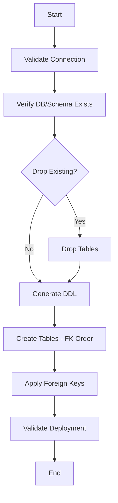
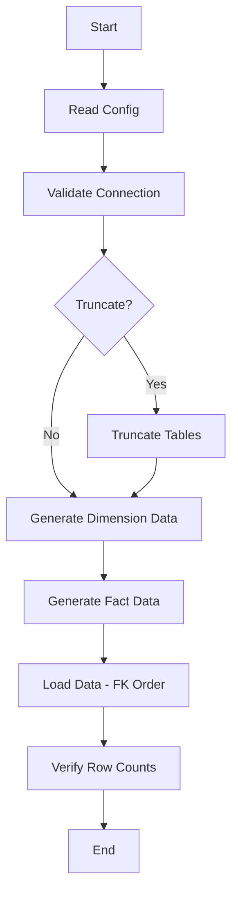

# E-Commerce Data Warehouse - User Guide

This guide covers all operations for the E-Commerce Data Warehouse system.

> **Supported Platforms:** Currently Snowflake. BigQuery, Redshift, and Databricks connectors are planned.

## Table of Contents

1. [Getting Started](#getting-started)
2. [CLI Commands Reference](#cli-commands-reference)
3. [Workflows](#workflows)
4. [Testing](#testing)
5. [Troubleshooting](#troubleshooting)

---

## Getting Started

### Initial Setup

```bash
# 1. Create and activate virtual environment
python3 -m venv venv
source venv/bin/activate

# 2. Install the package
pip install -e ".[dev]"

# 3. Configure credentials
cp .env.example .env
# Edit .env with your Snowflake credentials

# 4. Verify connection
dwh test-connection
```

### First Deployment

```bash
# Full deployment in one command (creates tables + generates data + loads)
source venv/bin/activate && dwh create-and-load --drop-existing

# Or step-by-step:
# 1. Preview what will be created
dwh setup-tables --dry-run

# 2. Create all tables
dwh setup-tables

# 3. Generate initial data
dwh generate-initial

# 4. Load data into Snowflake
dwh load-data --mode initial --truncate

# 5. Verify deployment
dwh validate
```

---

## CLI Commands Reference

### Connection Commands

#### `dwh test-connection`

Tests connectivity to the configured data warehouse.

```bash
dwh test-connection
dwh test-connection --timeout=60
```

#### `dwh status`

Shows current deployment status.

```bash
dwh status
```

### SQL Generation

#### `dwh generate-sql`

Generates DDL/DML SQL files to `outputs/generated_sql/`.

```bash
# Generate all SQL
dwh generate-sql

# Generate with DROP statements
dwh generate-sql --include-drops

# Generate for specific table
dwh generate-sql --table dim_customers

# Custom output directory
dwh generate-sql -o my_sql_files
```

### Table Creation Commands

#### `dwh create`

Creates tables in the configured data warehouse.

```bash
# Create all tables
dwh create

# Dry run (preview)
dwh create --dry-run

# Create specific table
dwh create --table dim_customers

# Skip foreign keys
dwh create --skip-fk
```

#### `dwh setup-tables`

One-time table setup workflow.

```bash
# Create schema with all tables
dwh setup-tables

# Specify database and schema
dwh setup-tables --database ECOMMERCE_DB --schema E_MART

# Recreate (drop existing first)
dwh setup-tables --drop-existing

# Dry run
dwh setup-tables --dry-run

# Skip foreign keys
dwh setup-tables --skip-fk
```

### Data Commands

#### `dwh generate-initial`

Generates initial bulk load data to CSV files.

```bash
# Generate with default counts (from datagen_config.yaml)
dwh generate-initial

# Custom counts
dwh generate-initial --customers 1000 --products 5000 --orders 50000

# Custom output directory
dwh generate-initial -o my_data

# Set random seed for reproducibility
dwh generate-initial --seed 123

# Skip validation
dwh generate-initial --no-validate
```

#### `dwh generate-incremental`

Generates incremental data across a date range.

```bash
# Use config defaults
dwh generate-incremental

# Specify date range
dwh generate-incremental --start-date 2026-02-01 --end-date 2026-02-28

# Override counts
dwh generate-incremental --customers 50 --orders 500
```

#### `dwh load-data`

Loads data from CSV files into the configured data warehouse.

```bash
# Load initial data (from outputs/initial_data)
dwh load-data --mode initial

# Load incremental data (from outputs/incremental_data)
dwh load-data --mode incremental

# Custom input directory
dwh load-data -i my_data

# Truncate before loading
dwh load-data --truncate

# Specific table only
dwh load-data --table dim_customers

# Custom batch size
dwh load-data --batch-size 50000

# Resume from failed state
dwh load-data --resume

# Show current load state
dwh load-data --show-state
```

#### `dwh create-and-load`

Deploy tables and load data. Behavior depends on `--drop-existing` flag.

```bash
# Fresh deployment (drop + recreate + load all)
dwh create-and-load --drop-existing

# Incremental (add new tables only, existing untouched)
dwh create-and-load

# Override data volumes
dwh create-and-load --drop-existing --customers=1000 --products=5000 --orders=20000

# Only create tables, skip data generation and loading
dwh create-and-load --skip-load

# Skip foreign key constraints
dwh create-and-load --skip-fk
```

| Mode | Behavior |
|------|----------|
| `--drop-existing` | Fresh: drop all → create all → generate all → load all |
| (default) | Incremental: skip existing → create new → generate all → load new only |

Data volumes default to values in `datagen_config.yaml`. CLI arguments override config.

#### `dwh validate`

Validates deployment.

```bash
# Basic validation
dwh validate

# Check foreign keys
dwh validate --check-fk

# Check data presence
dwh validate --check-data
```

---

## Workflows

### Schema Creation Workflow

For initial setup or recreation of the database schema.



**Commands:**
```bash
# New deployment
dwh setup-tables

# Recreate from scratch
dwh setup-tables --drop-existing
```

### Data Load Workflow

For loading test or production data.



**Commands:**
```bash
# Full fresh deployment
source venv/bin/activate && dwh create-and-load --drop-existing

# Or step-by-step:
dwh generate-initial
dwh load-data --mode initial --truncate
```

### Configuration File

Data volumes are configured in `src/data_generators/datagen_config.yaml`.

The YAML supports environment variable overrides using `${ENV_VAR || default}` syntax:

```yaml
initial_load:
  customers: ${DATAGEN_CUSTOMERS || 1000}
  products: ${DATAGEN_PRODUCTS || 5000}
  stores: ${DATAGEN_STORES || 10}
  accounts: ${DATAGEN_ACCOUNTS || 1000}   # 1:1 with customers
  sales: ${DATAGEN_SALES || 10000}
  date_start: ${DATAGEN_DATE_START || 2025-01-01}
  date_end: ${DATAGEN_DATE_END || 2026-03-08}

incremental:
  start_date: ${DATAGEN_START_DATE || 2026-03-01}
  end_date: ${DATAGEN_END_DATE || 2026-03-08}
  new_customers: ${DATAGEN_NEW_CUSTOMERS || 25}  # auto-creates matching accounts
  new_orders: ${DATAGEN_NEW_ORDERS || 50}
```

**Override priority (highest to lowest):**
1. CLI arguments (`--customers=500`)
2. Environment variables (`DATAGEN_CUSTOMERS=500`)
3. Default values in YAML

---

## Testing

### Unit Tests

```bash
# Run all unit tests
source venv/bin/activate && pytest tests/ -v

# Run with coverage
pytest tests/ --cov=src --cov-report=term-missing

# Run specific test file
pytest tests/test_workflows.py -v

# Run tests matching pattern
pytest tests/ -k "test_workflow" -v
```

### Integration Tests

Integration tests require data warehouse credentials.

```bash
# Run integration tests (requires DWH connection)
source venv/bin/activate && pytest tests/test_integration.py -v

# Run platform-specific tests only
pytest tests/test_integration.py -v -m "snowflake_required"
```

### Test Phases

| Phase | Tests |
|-------|-------|
| 1 | Logger, BaseTable, Connector imports |
| 2 | Table definitions, DDL generator, Schema manager |
| 3 | Table creation, FK constraints |
| 4 | CLI imports, Pipeline stages |
| 5 | Data generation, Referential integrity |
| 6 | Data loading, Row count verification |
| 7 | Workflow execution |
| 8 | Sample queries, End-to-end flow |

---

## Troubleshooting

### Connection Issues

**Error:** `Connection refused` or `Account not found`

**Solution:**
1. Verify `.env` file has correct credentials
2. Check account identifier format (e.g., `abc12345.us-east-1`)
3. Verify network connectivity to Snowflake

```bash
# Debug connection
dwh test-connection -v
```

### Deployment Failures

**Error:** `Table already exists`

**Solution:**
```bash
# Drop and recreate
dwh setup-tables --drop-existing
```

**Error:** `Foreign key constraint violation`

**Solution:**
```bash
# Create tables without FKs first
dwh create --skip-fk

# Or skip FKs in setup-tables
dwh setup-tables --skip-fk
```

### Data Loading Issues

**Error:** `Referential integrity violation`

**Solution:**
1. Ensure dimensions are loaded before facts
2. Use `dwh load-data` which handles ordering automatically

**Error:** `Out of memory`

**Solution:**
```bash
# Use smaller batch size
dwh load-data --batch-size=5000
```

### Test Failures

**Error:** `DWH credentials not configured`

**Solution:**
1. Set up `.env` file
2. Or run unit tests only: `pytest tests/ -m "not snowflake"`

### Log Files

Check logs in the `logs/` directory:
- `dwh_YYYYMMDD_HHMMSS.log` - Application logs
- `test_run_*.log` - Test execution logs

---

## Best Practices

### Development

1. Always use virtual environment
2. Run `dwh setup-tables --dry-run` before actual deployment
3. Use `--seed` for reproducible test data
4. Run unit tests before committing changes

### Production

1. Use separate environments (dev/staging/prod)
2. Review generated SQL before deployment
3. Enable foreign key validation
4. Monitor logs for errors

### Data Loading

1. Start with small datasets for testing
2. Use `--truncate` for full refreshes
3. Save CSV backups with `--save-csv`
4. Verify row counts after loading

---

**Version:** 1.1  
**Last Updated:** March 9, 2026
