# E-Commerce Data Warehouse - Development Phases

This folder contains detailed documentation for each development phase of the E-Commerce Data Warehouse project.

## Phase Index

| Phase | Name | Status | File |
|-------|------|--------|------|
| 1 | Foundation Setup | ✅ Complete | [phase1_foundation.md](phase1_foundation.md) |
| 2 | Table Models & SQL Generation | ✅ Complete | [phase2_table_models.md](phase2_table_models.md) |
| 3 | Table Creation & Deployment | ✅ Complete | [phase3_table_creation.md](phase3_table_creation.md) |
| 4 | CLI & Orchestration Framework | ✅ Complete | [phase4_cli_orchestration.md](phase4_cli_orchestration.md) |
| 5 | Test Data Generation | ✅ Complete | [phase5_data_generation.md](phase5_data_generation.md) |
| 6 | Data Loading Module | ✅ Complete | [phase6_data_loading.md](phase6_data_loading.md) |
| 7 | Execution Workflows | ✅ Complete | [phase7_workflows.md](phase7_workflows.md) |
| 8 | Audience Analytics | ✅ Complete | [phase8_audience_analytics.md](phase8_audience_analytics.md) |
| 9 | Account Dimension | ✅ Complete | [phase9_account_dimension.md](phase9_account_dimension.md) |

## Quick Start

For project overview and architecture, see the main [PLAN.md](PLAN.md).

## Phase Dependencies

```mermaid
flowchart LR
    P1[Phase 1: Foundation] --> P2[Phase 2: Table Models]
    P2 --> P3[Phase 3: Deployment]
    P3 --> P4[Phase 4: CLI]
    P4 --> P5[Phase 5: Data Gen]
    P5 --> P6[Phase 6: Data Load]
    P6 --> P7[Phase 7: Workflows]
    P7 --> P8[Phase 8: Integration]
    P8 --> P9[Phase 9: Account Dim]
```

---

**Last Updated:** March 9, 2026
