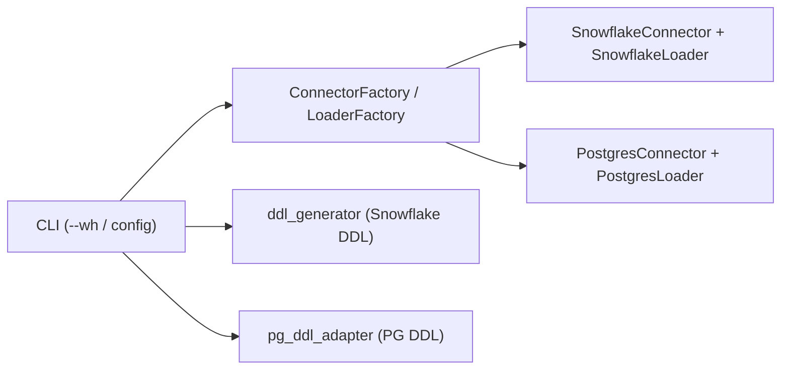

# Phase 10: PostgreSQL Support

## Overview

Add PostgreSQL as a first-class warehouse target alongside Snowflake. Introduces a PG connector, PG-specific data loader, DDL type adapter, connector/loader factories, and CLI platform switching — all without modifying existing Snowflake code paths.

## Status: Complete

---

## Design

Four new modules, one adapter, two factories, and CLI wiring:

**PostgresConnector** -- psycopg2-based connector implementing `BaseConnector`. Context manager with explicit commit/rollback. Sets `search_path` automatically when schema is not `public`.

**PostgresLoader** -- `BaseDataLoader` implementation with two load strategies:

| Strategy | Trigger | Method |
|---|---|---|
| `execute_values` | < 100K rows | `psycopg2.extras.execute_values` with `page_size=1000` |
| `COPY FROM STDIN` | >= 100K rows or CSV path | `cursor.copy_expert` |

**PgDDLAdapter** -- Stateless functions that transform `BaseTable` column definitions to PostgreSQL DDL without touching the Snowflake `ddl_generator`. Type mapping:

| Snowflake | PostgreSQL |
|---|---|
| `NUMBER(38,0)` | `BIGINT` |
| `NUMBER(p,0)` p≤9 | `INTEGER` |
| `NUMBER(p,0)` p≤18 | `BIGINT` |
| `NUMBER(p,s)` s>0 | `NUMERIC(p,s)` |
| `VARCHAR(n)` | `VARCHAR(n)` |
| `TIMESTAMP_NTZ` | `TIMESTAMP WITHOUT TIME ZONE` |
| `BOOLEAN`, `DATE`, `TIME` | passthrough |
| `FLOAT` | `DOUBLE PRECISION` |

Foreign keys use 2-part qualified names (`schema.table`). Comments emitted as separate `COMMENT ON TABLE` / `COMMENT ON COLUMN` statements.

**Connector Factory** -- `src/connectors/factory.py` returns `SnowflakeConnector` or `PostgresConnector` based on platform string.

**Loader Factory** -- `src/data_loaders/factory.py` returns the correct loader for the active connector.

**CLI `--wh` flag** -- `dwh generate-sql --wh pg` generates PG DDL. All other commands read the active platform from `dwh config set-wh` / `.dwh.yaml` / env var, so switching between Snowflake and Postgres requires no per-command flags.

---

## Files Changed

| File | Change |
|---|---|
| `src/connectors/postgres_connector.py` | New — psycopg2 connector |
| `src/data_loaders/postgres_loader.py` | New — execute_values + COPY loader |
| `src/sql_generator/pg_ddl_adapter.py` | New — type mapper + DDL generators |
| `src/connectors/factory.py` | New — connector factory |
| `src/data_loaders/factory.py` | New — loader factory |
| `src/connectors/__init__.py` | Export factory + platform helpers |
| `src/data_loaders/__init__.py` | Export factory |
| `src/models/base_table.py` | Minor: platform-neutral helpers |
| `src/cli/main.py` | `require_dwh_platform`, platform display |
| `src/cli/commands/generate_sql.py` | `--wh` flag, PG DDL code path |
| `src/cli/commands/create_tables.py` | Routes to correct connector |
| `src/cli/commands/load_data.py` | Routes to correct loader |
| `src/cli/commands/run_sql.py` | Platform-aware SQL execution |
| `src/cli/commands/workflows.py` | Platform-aware workflow |
| `src/cli/commands/connection.py` | PG connection test |
| `src/sql_generator/schema_manager.py` | PG schema creation support |
| `src/table_manager/create_tables.py` | PG table creation path |
| `src/workflows/table_setup_workflow.py` | Platform-aware setup workflow |
| `.env.example` | Added `POSTGRES_*` vars |
| `pyproject.toml` | Added `psycopg2-binary` dependency |

---

## Deliverables

- [x] `src/connectors/postgres_connector.py` -- psycopg2 connector with context manager
- [x] `src/connectors/factory.py` -- connector factory
- [x] `src/data_loaders/postgres_loader.py` -- execute_values + COPY FROM STDIN loader
- [x] `src/data_loaders/factory.py` -- loader factory
- [x] `src/sql_generator/pg_ddl_adapter.py` -- Snowflake-to-PG type mapping and DDL generation
- [x] `src/cli/main.py` -- `require_dwh_platform` helper, platform display in help text
- [x] `src/cli/commands/generate_sql.py` -- `--wh pg` flag routes to pg_ddl_adapter
- [x] All other CLI commands -- platform-aware via factory
- [x] `src/table_manager/create_tables.py` -- PG table creation with schema creation
- [x] `src/workflows/table_setup_workflow.py` -- platform-aware setup workflow
- [x] `.env.example` -- PG connection variable template
- [x] `pyproject.toml` -- `psycopg2-binary` added
- [x] `tests/test_postgres_connector.py` -- 12 tests
- [x] `tests/test_postgres_loader.py` -- 13 tests
- [x] `tests/test_pg_ddl_adapter.py` -- 25 tests
- [x] `plans/PLAN.md` -- Phase 10 row added

---

## Testing

50 tests across three files:

**test_postgres_connector.py** (12 tests)
- Missing `user` / `database` env vars raise `ValueError`
- Default values read from env (`host=localhost`, `port=5432`, `schema=public`)
- Explicit constructor params override env vars
- `connect()` sets `search_path` for non-public schemas; skips it for `public`
- `execute_query` returns rows when description present; returns `[]` for DDL
- `table_exists` queries `information_schema.tables` correctly
- Context manager connects on enter and closes on exit
- Context manager rolls back on exception

**test_postgres_loader.py** (13 tests)
- `platform_name` returns `"postgres"`
- Loader inherits schema and database from connector
- Small DataFrames route to `execute_values`
- `NaN` values converted to `None` before insert
- Empty DataFrame returns validation error without touching DB
- `truncate_before_load=True` calls `TRUNCATE ... CASCADE` first
- `load_csv` returns error for missing file
- `load_csv` calls `copy_expert` with correct COPY SQL
- `truncate_table` uses `CASCADE` and commits
- `table_exists` delegates to connector
- `get_row_count` returns correct count from connector

**test_pg_ddl_adapter.py** (25 tests)
- Type mapping: `NUMBER(38)` → `BIGINT`, small precision → `INTEGER`, monetary → `NUMERIC`, `TIMESTAMP_NTZ` → `TIMESTAMP WITHOUT TIME ZONE`, passthrough types, `FLOAT` → `DOUBLE PRECISION`
- `map_column_to_pg`: basic column, column with default, VARCHAR, comments excluded from column def
- `generate_pg_create_table`: structure includes `CREATE TABLE IF NOT EXISTS`, no Snowflake-specific syntax (`AUTOINCREMENT`, `CLUSTER BY`, `COMMENT =`)
- Table and column `COMMENT ON` statements generated correctly
- Single quote escaping in comment strings
- `generate_pg_drop_table`: emits `DROP TABLE IF EXISTS ... CASCADE`
- FK generation: constraint name, `REFERENCES` with 2-part name, `ON DELETE CASCADE`, empty FK list
