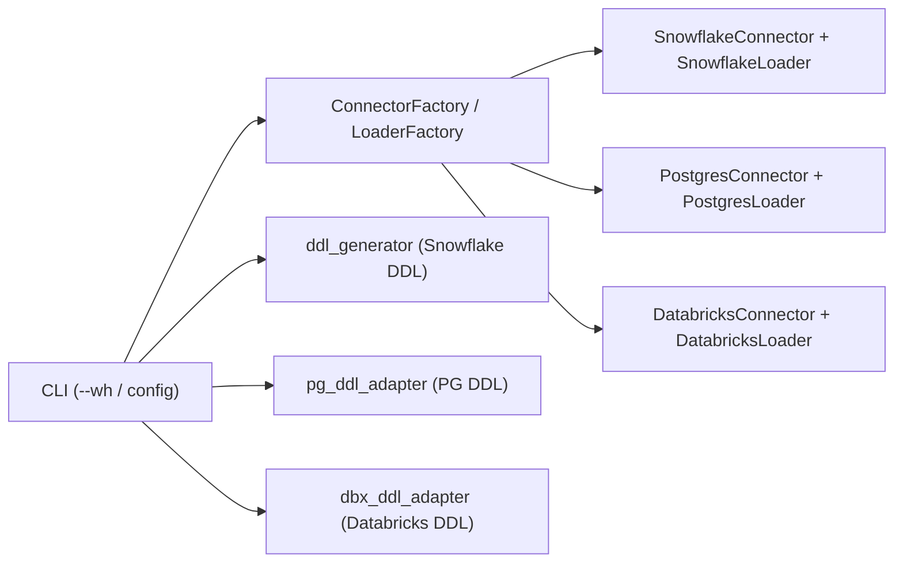

# Phase 11: Databricks Support

## Overview

Add Databricks (Delta Lake on Unity Catalog) as a third first-class warehouse target alongside Snowflake and PostgreSQL. Mirrors the Phase 10 Postgres pattern: new connector, new loader, new DDL adapter, registry additions in the existing factories, and CLI wiring — no changes to the Snowflake or Postgres code paths.

**Scope:** All 23 tables including the customer dimension split (`dim_customers`, `dim_customer_address`, `dim_customer_loyalty`).

## Status: Complete

---

## Design

Four new modules, one adapter, factory registrations, and CLI wiring.

**DatabricksConnector** — `databricks-sql-connector`-based connector implementing `BaseConnector`. Context manager. Uses Databricks SQL Warehouse (serverless or pro) via HTTP path + access token. Sets the active catalog and schema after connect (`USE CATALOG`, `USE SCHEMA`). Autocommit is always on in Databricks SQL, so `commit()` / `rollback()` are no-ops with a warning logged on rollback.

Auth params (env-driven, precedence: constructor → env → default):

| Var | Purpose |
|---|---|
| `DATABRICKS_SERVER_HOSTNAME` | Workspace host, e.g. `adb-123.4.azuredatabricks.net` |
| `DATABRICKS_HTTP_PATH` | SQL warehouse HTTP path |
| `DATABRICKS_ACCESS_TOKEN` | Personal access token or OAuth token |
| `DATABRICKS_CATALOG` | Unity Catalog name (default `hive_metastore` fallback discouraged) |
| `DATABRICKS_SCHEMA` | Schema (default `ecommerce_dwh`) |

**DatabricksLoader** — `BaseDataLoader` implementation with two load strategies (no `COPY INTO`):

| Strategy | Trigger | Method |
|---|---|---|
| `executemany` (INSERT VALUES) | < 10K rows | `cursor.executemany` on parameterised INSERT |
| Arrow upload + `INSERT ... SELECT` | >= 10K rows, and CSV path | `databricks-sql-connector` pyarrow path — DataFrame converted to an Arrow table, inserted in chunks |

`load_csv` reads the file into pandas and dispatches through the same two strategies — no cloud-storage staging, no Volumes, no Files API dependency.

Merge/upsert support (future): `MERGE INTO` for SCD Type 2 updates — out of scope for Phase 11, tracked separately.

**DbxDDLAdapter** — stateless functions transforming `BaseTable` column definitions to Databricks SQL DDL. All tables emit as Delta (`USING DELTA` is the default on Unity Catalog; explicit for clarity). Type mapping:

| Snowflake | Databricks |
|---|---|
| `NUMBER(38,0)` | `BIGINT` |
| `NUMBER(p,0)` p ≤ 9 | `INT` |
| `NUMBER(p,0)` p ≤ 18 | `BIGINT` |
| `NUMBER(p,0)` p > 18 | `DECIMAL(p,0)` |
| `NUMBER(p,s)` s > 0 | `DECIMAL(p,s)` |
| `VARCHAR(n)` | `STRING` (length ignored — Databricks STRING has no length constraint; length preserved in column comment) |
| `TIMESTAMP_NTZ` | `TIMESTAMP_NTZ` (native since DBR 13.3 LTS) |
| `TIMESTAMP` | `TIMESTAMP` |
| `DATE`, `TIME`, `BOOLEAN` | passthrough (`TIME` → `STRING` — Databricks has no TIME type) |
| `FLOAT` | `DOUBLE` |
| `VARIANT`, `OBJECT`, `ARRAY` | `VARIANT` (native — **requires DBR 15.3+ and Unity Catalog**) |
| `BINARY`, `VARBINARY` | `BINARY` |
| `GEOGRAPHY`, `GEOMETRY` | `STRING` |

Naming uses 3-part qualified names (`catalog.schema.table`) — Unity Catalog only, no `hive_metastore` support. Primary keys and foreign keys are emitted as **informational constraints** (`PRIMARY KEY ... NOT ENFORCED RELY` and `FOREIGN KEY ... NOT ENFORCED RELY`). These aid query optimisation and BI tool discovery but are not enforced at write time — referential integrity must be guaranteed by the data-generation pipeline (already the case).

**Minimum runtime:** DBR 15.3 LTS (required for native `VARIANT` used by the new `customer_preferences`, `event_properties`, `order_tags`, `shipment_metadata` columns).

Comments are emitted inline in `CREATE TABLE` (`COMMENT 'text'` per column and at table level) — Databricks does not use separate `COMMENT ON` statements for Delta.

Identity columns: `GENERATED ALWAYS AS IDENTITY` on surrogate keys. Snowflake `AUTOINCREMENT` is stripped by the adapter; Databricks identity syntax is substituted.

**Connector Factory** — `src/connectors/factory.py` adds `db` / `databricks` entries to `DWH_REGISTRY` pointing at `DatabricksConnector`. The placeholder comments in that file become real imports.

**Loader Factory** — `src/data_loaders/factory.py` adds a `platform == "databricks"` branch returning `DatabricksLoader`.

**CLI** — No new flags. The existing `--wh` flag, `dwh config set-wh`, and `.dwh.yaml` resolution already handle arbitrary platform strings via the factory. `dwh generate-sql --wh dbx` will route to `dbx_ddl_adapter`. All other commands pick up the active platform via `require_dwh_platform` and the factories.



---

## Files to Change

| File | Change |
|---|---|
| `src/connectors/databricks_connector.py` | New — `databricks-sql-connector` wrapper |
| `src/data_loaders/databricks_loader.py` | New — executemany + Arrow + COPY INTO loader |
| `src/sql_generator/dbx_ddl_adapter.py` | New — type mapper + DDL generators |
| `src/connectors/factory.py` | Register `db` / `databricks` entries |
| `src/data_loaders/factory.py` | Add `databricks` branch |
| `src/connectors/__init__.py` | Export `DatabricksConnector` |
| `src/data_loaders/__init__.py` | Export `DatabricksLoader` |
| `src/cli/main.py` | Include Databricks in platform validation + display |
| `src/cli/commands/generate_sql.py` | `--wh dbx` routes to `dbx_ddl_adapter` |
| `src/cli/commands/create_tables.py` | Databricks path via factory (expected to require no change if factory covers it) |
| `src/cli/commands/load_data.py` | Databricks path via factory |
| `src/cli/commands/run_sql.py` | Platform-aware SQL execution |
| `src/cli/commands/workflows.py` | Platform-aware workflow |
| `src/cli/commands/connection.py` | Databricks connection test |
| `src/sql_generator/schema_manager.py` | Databricks `CREATE SCHEMA IF NOT EXISTS catalog.schema` support |
| `src/table_manager/create_tables.py` | Databricks table creation path |
| `src/workflows/table_setup_workflow.py` | Platform-aware setup workflow |
| `.env.example` | Add `DATABRICKS_*` vars |
| `pyproject.toml` | Add `databricks-sql-connector` dependency |
| `src/config/environments.yaml` | Databricks section |
| `plans/PLAN.md` | Phase 11 row added |

---

## Dependencies

Add to `pyproject.toml`:

```toml
databricks-sql-connector = ">=3.0.0"
pyarrow = ">=14.0.0"   # transitively required; pin for cloud fetch
```

---

## Deliverables

- [x] `src/connectors/databricks_connector.py` — connector with context manager
- [x] `src/connectors/factory.py` — register `db` / `dbx` / `databricks`
- [x] `src/data_loaders/databricks_loader.py` — executemany loader (no COPY INTO)
- [x] `src/data_loaders/factory.py` — add `databricks` branch
- [x] `src/sql_generator/dbx_ddl_adapter.py` — Snowflake → Databricks type mapping + DDL
- [x] `src/cli/main.py` — platform list shows Databricks (not placeholder)
- [x] `src/cli/commands/generate_sql.py` — `--wh dbx` / `--all` routes to `dbx_ddl_adapter`
- [x] All other CLI commands — platform-aware via factories
- [x] `src/sql_generator/schema_manager.py` — Databricks script saving + schema creation
- [x] `src/table_manager/create_tables.py` — Databricks table creation and verification
- [x] `src/workflows/table_setup_workflow.py` — platform-aware drop (no CASCADE on Databricks) and view creation
- [x] `.env.example` — `DATABRICKS_*` vars template
- [x] `pyproject.toml` — `databricks-sql-connector` optional extra added
- [x] `tests/test_databricks_connector.py` — 15 tests
- [x] `tests/test_databricks_loader.py` — 15 tests
- [x] `tests/test_dbx_ddl_adapter.py` — 39 tests
- [x] `plans/PLAN.md` — Phase 11 row added

---

## Testing Plan

Three test files, all using `unittest.mock` for the `databricks.sql` module — no live workspace required for unit tests.

**test_databricks_connector.py (~12 tests)**

- Missing `server_hostname` / `http_path` / `access_token` raise `ValueError`
- Default values read from env; explicit constructor params override
- `connect()` issues `USE CATALOG` and `USE SCHEMA` when provided
- `execute_query` returns rows when `description` present; returns `[]` for DDL
- `table_exists` queries `information_schema.tables` correctly with catalog filter
- `commit()` / `rollback()` are no-ops (autocommit) — log but do not error
- Context manager connects on enter, closes on exit
- Context manager closes cleanly on exception (no rollback needed)

**test_databricks_loader.py (~12 tests)**

- `platform_name` returns `"databricks"`
- Loader inherits catalog + schema from connector
- Small DataFrames (< 10K) route to `executemany`
- Larger DataFrames (>= 10K) route to Arrow upload path
- `NaN` → `None` conversion before `executemany`
- Empty DataFrame returns validation error without touching workspace
- `truncate_before_load=True` calls `TRUNCATE TABLE` first (supported on Delta)
- `load_csv` returns error for missing file
- `load_csv` reads into pandas and dispatches through the same two strategies
- `truncate_table` commits (no-op) and succeeds
- `table_exists` delegates to connector
- `get_row_count` returns correct count from connector

**test_dbx_ddl_adapter.py (~25 tests)**

- Type mapping: `NUMBER(38)` → `BIGINT`, small precision → `INT`, monetary → `DECIMAL`, `TIMESTAMP_NTZ` passthrough, `FLOAT` → `DOUBLE`, `VARCHAR` → `STRING`, `VARIANT/OBJECT/ARRAY` → `VARIANT`
- `map_column_to_dbx`: basic column, column with default, STRING (length in comment), comments inline
- `generate_dbx_create_table`: includes `CREATE TABLE IF NOT EXISTS`, `USING DELTA`, inline `COMMENT`, no Snowflake-specific syntax (`CLUSTER BY`, `COMMENT =`, `AUTOINCREMENT`)
- Identity columns: `GENERATED ALWAYS AS IDENTITY` emitted for surrogate keys
- PK emitted as `PRIMARY KEY (...) NOT ENFORCED RELY`
- Single-quote escaping in comment strings
- `generate_dbx_drop_table`: emits `DROP TABLE IF EXISTS catalog.schema.table`
- FK generation: constraint name, `REFERENCES` with 3-part name, `NOT ENFORCED RELY`, `ON DELETE` clause omitted (not supported on Delta FKs), empty FK list

**Integration tests (optional, gated on env var `DATABRICKS_ACCESS_TOKEN`):**

- `test_databricks_integration.py` — full round-trip against a real SQL warehouse: create schema → create all 23 tables → load small synthetic dataset → validate row counts → drop schema.

---

## Decisions

1. **Unity Catalog only.** No `hive_metastore` support. 3-part naming (`catalog.schema.table`). Informational FK/PK constraints emitted as `NOT ENFORCED RELY` for BI-tool relationship discovery and query-planner hints.
2. **No `COPY INTO`.** Loader uses `executemany` for small DataFrames and Arrow upload + `INSERT ... SELECT` for larger ones. No UC Volumes, no Files API, no cloud-storage dependency.
3. **Native `VARIANT` required.** DBR 15.3+ required. No `STRING` fallback — the adapter fails fast with a clear message if the warehouse is older. Affects the `customer_preferences`, `event_properties`, `order_tags`, `shipment_metadata` columns added in commit `89aba5a`.
4. **Identity columns:** emit `GENERATED ALWAYS AS IDENTITY` on surrogate keys. Our loader writes explicit key values from the data generator, so identity defaults only fire on nulls — safe.

---

**Version:** 1.0
**Last Updated:** 2026-04-25
**Status:** Ready to implement — decisions closed (UC-only, native VARIANT, no COPY INTO)
