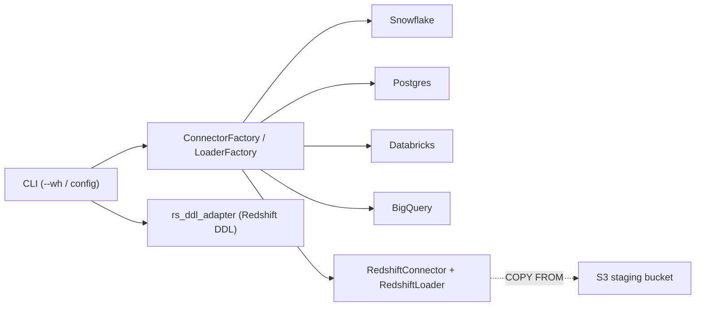

# Phase 13: Amazon Redshift Support

## Overview

Add Amazon Redshift as the fifth first-class warehouse target alongside Snowflake, PostgreSQL, Databricks, and BigQuery. Mirrors the Phase 10/11/12 pattern: new connector, new loader, new DDL adapter, factory registrations, CLI wiring — no changes to existing platforms.

**Scope:** All 23 tables including the customer dimension split (`dim_customers`, `dim_customer_address`, `dim_customer_loyalty`) and the unsupported-type columns (VARIANT, GEOGRAPHY, BINARY).

## Status: Decisions resolved — ready to implement

---

## Lessons applied from Phases 11 & 12

To avoid repeating the multi-cycle debug loops:

1. **Validate against a real Redshift endpoint before declaring done.** A one-shot smoke test (create temp table → load one row touching SUPER, GEOGRAPHY, VARBYTE, TIMESTAMPTZ → select back → drop) catches paramstyle, IAM, and S3-staging bugs that mocks can't surface. Same gating pattern as `tests/test_bigquery_smoke.py`.
2. **Pick the load strategy that the platform is actually built for.** BigQuery taught us that row-by-row INSERTs are the wrong default; for Redshift the equivalent lesson is that `COPY FROM s3://...` is the only path that performs — single-leader INSERTs are catastrophically slow on a fact table. Plan around COPY from day one.
3. **Read the SDK docs on type binding before picking an approach.** `redshift-connector` uses `pyformat` paramstyle and has explicit handling for SUPER (JSON-encoded string at insert time, parsed by `JSON_PARSE`) and GEOGRAPHY (WKT via `ST_GeogFromText`). Map these in the adapter, not at call sites.
4. **Don't autodetect schema from the DataFrame.** BigQuery's smoke test exposed FLOAT64 vs NUMERIC drift. For Redshift, fetch the destination table's columns from `pg_table_def` / `information_schema.columns` and use that to drive per-column serialization (Decimal → string, dict → JSON string, bytes → hex literal).

---

## Design

Four new modules, one adapter, factory registrations.

**RedshiftConnector** — wraps Amazon's official `redshift-connector` driver. Exposes the same `BaseConnector` surface as the other connectors so the factory works unchanged. Two auth modes supported, selected by `REDSHIFT_AUTH_METHOD`:

| Mode | Driver path | Required env |
|---|---|---|
| `password` (default) | `redshift_connector.connect(host=..., user=..., password=...)` | `REDSHIFT_HOST`, `REDSHIFT_PORT`, `REDSHIFT_DATABASE`, `REDSHIFT_USER`, `REDSHIFT_PASSWORD` |
| `iam` | `redshift_connector.connect(iam=True, cluster_identifier=..., db_user=..., access_key_id=..., secret_access_key=..., session_token=...)` | `REDSHIFT_CLUSTER_IDENTIFIER`, `REDSHIFT_DB_USER`, `AWS_REGION`, plus standard AWS credential resolution (env / `~/.aws/credentials` / instance profile) |

Auth precedence matches the other platforms: explicit constructor arg → env var → driver default. Schema set via `SET search_path TO <schema>` after connect (Postgres-compatible, same as `PostgresConnector`). Transactions follow Postgres semantics (autocommit off; explicit `commit()`/`rollback()`), unlike the no-op `commit()` on Databricks/BigQuery.

Auth env vars:

| Var | Purpose |
|---|---|
| `REDSHIFT_AUTH_METHOD` | `password` (default) or `iam` |
| `REDSHIFT_HOST` | Cluster endpoint, e.g. `mycluster.abc123.us-east-1.redshift.amazonaws.com` (provisioned) or workgroup endpoint (serverless) |
| `REDSHIFT_PORT` | Default `5439` |
| `REDSHIFT_DATABASE` | Database name |
| `REDSHIFT_SCHEMA` | Schema (default `ecommerce_dwh`) |
| `REDSHIFT_USER` / `REDSHIFT_PASSWORD` | password mode |
| `REDSHIFT_CLUSTER_IDENTIFIER` | IAM mode (provisioned) |
| `REDSHIFT_WORKGROUP_NAME` | IAM mode (serverless) |
| `REDSHIFT_DB_USER` | IAM-mapped DB user |
| `AWS_REGION` | Region for IAM token + COPY |

Both provisioned clusters and Redshift Serverless workgroups are supported through the same connector — the only practical difference is which identifier (`cluster_identifier` vs `serverless_acct_id` + `workgroup_name`) is supplied in IAM mode.

**RedshiftLoader** — `BaseDataLoader` implementation with two strategies:

| Strategy | Trigger | Method |
|---|---|---|
| `executemany` (INSERT VALUES) | < 5K rows or `REDSHIFT_LOADER_MODE=insert` | `cursor.executemany(...)` with pyformat params |
| `COPY FROM s3://...` (recommended) | >= 5K rows or fact-table loads | DataFrame → newline-delimited JSON → upload to `s3://<staging-bucket>/<key>` → `COPY <table> FROM 's3://...' IAM_ROLE '<arn>' FORMAT AS JSON 'auto' REGION '<region>'` → delete S3 object on success |

The 5K row threshold is lower than Databricks (10K) because Redshift's leader-node serialisation makes INSERT VALUES cliff much earlier in practice.

S3 staging:
- Bucket from `REDSHIFT_S3_STAGING_BUCKET` (required for COPY mode). Object key derived from database + schema + table — `<REDSHIFT_DATABASE>/<REDSHIFT_SCHEMA>/<table>/<utc_iso>-<uuid>.json.gz` — mirroring BigQuery's `<project>/<dataset>/<table>` layout. No separate prefix env var.
- IAM role ARN from `REDSHIFT_COPY_IAM_ROLE` — must be attached to the cluster/workgroup with `s3:GetObject` on the staging bucket. This is the standard Redshift COPY pattern; no per-call AWS keys.
- Cleanup: each load uploads, runs COPY in a single transaction, deletes the S3 object on commit. On failure, the object stays (intentional, for debugging) and is reaped by an optional `dwh redshift gc-staging` step or bucket lifecycle rule.

Special-type handling on insert / load:
- **SUPER** (`customer_preferences`, `event_properties`, `order_tags`, `shipment_metadata`): serialize Python `dict`/`list` to JSON string client-side; on COPY use `FORMAT AS JSON 'auto'` and let the column type drive parsing; on INSERT wrap with `JSON_PARSE(%s)`.
- **GEOGRAPHY** (`home_location`, `geo_location`): WKT text in the DataFrame. On COPY: stage as text and run a follow-up `UPDATE ... = ST_GeogFromText(col)` if the COPY-time auto-cast fails (Redshift's COPY into GEOGRAPHY accepts WKT as of 2024 but only for certain formats — verify in smoke test). On INSERT: wrap with `ST_GeogFromText(%s)`.
- **VARBYTE** (`raw_payload`, base64 ASCII in source): decode to bytes, then for COPY emit hex string in the JSON staging file (Redshift COPY accepts hex-encoded VARBYTE); for INSERT bind raw bytes via the driver.
- **TIMESTAMP / TIMESTAMPTZ**: serialise as ISO 8601 strings; rely on Redshift's implicit cast.
- **NUMERIC(p,s)**: serialise as string (avoids float drift, mirrors the BigQuery fix).

Truncate-before-load: `TRUNCATE <table>` (Redshift TRUNCATE auto-commits and is fast — the standard approach).

**RsDDLAdapter** — stateless functions transforming `BaseTable` → Redshift DDL.

Type mapping:

| Snowflake | Redshift |
|---|---|
| `NUMBER(38,0)` | `BIGINT` |
| `NUMBER(p,0)` p ≤ 4 | `SMALLINT` |
| `NUMBER(p,0)` 5 ≤ p ≤ 9 | `INTEGER` |
| `NUMBER(p,0)` 10 ≤ p ≤ 18 | `BIGINT` |
| `NUMBER(p,0)` p > 18 | `NUMERIC(p,0)` (max precision 38) |
| `NUMBER(p,s)` s > 0 | `NUMERIC(p,s)` |
| `VARCHAR(n)` | `VARCHAR(n)` (Redshift max `65535`; values above clamped to `65535` with a warning) |
| `VARCHAR` (no length) | `VARCHAR(MAX)` → `VARCHAR(65535)` |
| `TIMESTAMP_NTZ` | `TIMESTAMP` (no TZ) |
| `TIMESTAMP` (with TZ) | `TIMESTAMPTZ` |
| `DATE` | `DATE` |
| `TIME` | `TIME` |
| `BOOLEAN` | `BOOLEAN` |
| `FLOAT`, `DOUBLE` | `DOUBLE PRECISION` |
| `VARIANT`, `OBJECT`, `ARRAY` | `SUPER` (native semi-structured) |
| `BINARY`, `VARBINARY` | `VARBYTE` |
| `GEOGRAPHY` | `GEOGRAPHY` (native) |
| `GEOMETRY` | `GEOMETRY` (native) |

3-part naming is **not** used — Redshift does not support cross-database queries from the loader's connection (Spectrum aside). DDL emits 2-part `schema.table`, with `database` selected at connect time.

PK/FK as **informational constraints**:
- Redshift accepts `PRIMARY KEY`, `UNIQUE`, and `FOREIGN KEY` clauses but **does not enforce them**. The query planner uses them for join elimination and rewrite. We emit them inline in `CREATE TABLE` (PK on the surrogate key column) and as `ALTER TABLE ... ADD CONSTRAINT ... FOREIGN KEY ... REFERENCES ...` post-hoc, mirroring the Postgres flow.

Identity columns: `GENERATED BY DEFAULT AS IDENTITY(1, 1)` on surrogate keys. The data generator writes explicit key values, so identity defaults only fire on nulls — same pattern as Databricks/BigQuery.

DEFAULT values: native column defaults supported.

Comments: `COMMENT ON TABLE` / `COMMENT ON COLUMN` (Postgres-style), emitted as separate statements after the CREATE TABLE block — same as the Postgres adapter.

Distribution + sort keys (Phase 13 baseline):
- `DISTSTYLE AUTO` on every table — Redshift adapts based on observed access patterns. No hand-tuned DISTKEYs in the initial cut.
- No explicit `SORTKEY` — Redshift's automatic sort-key selection (AUTO) handles this for the workload size we're targeting.
- Decision callout below if you'd rather hardcode dist/sort hints (e.g. `DISTKEY (customer_key)` on `fact_sales`) up front.

**Connector Factory** — uncomment `rs` / `redshift` entries in `DWH_REGISTRY`, import `RedshiftConnector`. The placeholder lines in `factory.py:44-46` become real.

**Loader Factory** — add `platform == "redshift"` branch returning `RedshiftLoader`.

**CLI** — `--wh rs` / `--wh redshift`. No new flags. Existing `dwh config set-wh`, `.dwh.yaml` resolution, and `require_dwh_platform` handle it via the factories.



---

## Files to Change

| File | Change |
|---|---|
| `src/connectors/redshift_connector.py` | New — `redshift-connector` wrapper with password + IAM auth |
| `src/data_loaders/redshift_loader.py` | New — executemany + S3-staged COPY loader |
| `src/sql_generator/rs_ddl_adapter.py` | New — Snowflake → Redshift type mapper + DDL generators |
| `src/connectors/factory.py` | Uncomment `rs` / `redshift` entries; import `RedshiftConnector` |
| `src/data_loaders/factory.py` | Add `redshift` branch |
| `src/connectors/__init__.py` | Export `RedshiftConnector` |
| `src/data_loaders/__init__.py` | Export `RedshiftLoader` |
| `src/cli/main.py` | Promote Redshift from placeholder → supported in display + validation |
| `src/cli/commands/generate_sql.py` | `--wh rs` routes to `rs_ddl_adapter`; add `redshift` to `--all` |
| `src/cli/commands/validate.py` | Add `is_redshift` branch (2-part naming, `pg_table_def` quirks) |
| `src/cli/commands/create_tables.py` | Redshift path via factory (expected to need no change beyond verification) |
| `src/cli/commands/load_data.py` | Redshift path via factory |
| `src/cli/commands/run_sql.py` | Platform-aware SQL execution |
| `src/cli/commands/workflows.py` | Platform-aware workflow |
| `src/cli/commands/connection.py` | Redshift connection test |
| `src/sql_generator/schema_manager.py` | `_save_redshift_scripts`; `CREATE SCHEMA IF NOT EXISTS` |
| `src/table_manager/create_tables.py` | Redshift verification + creation path |
| `src/workflows/table_setup_workflow.py` | Redshift drop syntax (`DROP TABLE IF EXISTS schema.table CASCADE`) and view dir |
| `.env.example` | Add `REDSHIFT_*`, `REDSHIFT_S3_STAGING_*`, `REDSHIFT_COPY_IAM_ROLE` |
| `pyproject.toml` | Add `redshift` optional extra |
| `src/config/environments.yaml` | Redshift section |
| `sql/redshift/03_user_grants.sql` | New — Redshift grants (analogous to existing `sql/databricks/`, `sql/bigquery/`) |
| `plans/PLAN.md` | Phase 13 row added |
| `tests/test_redshift_connector.py` | New — ~14 tests, mocked `redshift_connector` |
| `tests/test_redshift_loader.py` | New — ~14 tests, mocked driver + mocked `boto3.client('s3')` |
| `tests/test_rs_ddl_adapter.py` | New — ~30 tests |
| `tests/test_redshift_smoke.py` | **New — gated integration test against real Redshift cluster + S3 bucket** |

---

## Dependencies

Add to `pyproject.toml`:

```toml
redshift = [
    "redshift-connector>=2.1.0",   # Amazon's official driver — SUPER, IAM, IDP plugins
    "boto3>=1.34.0",               # S3 staging upload + STS for IAM auth
    "pyarrow>=14.0.0",             # already pinned for Databricks/BigQuery; keep
]
```

`boto3` is the AWS SDK for Python — needed both for the S3 PutObject during COPY staging and for the IAM-auth path's STS calls (`redshift-connector` uses it under the hood when `iam=True`).

---

## Decisions needed before implementation

Eight decisions, each framed as a question with the codebase-specific tradeoffs and a recommendation. Recommendations are tuned for *this* repo (demo-scale data, star schema with the recently added SUPER/GEOGRAPHY/VARBYTE columns, four other platforms already implemented as a pattern), not for a generic Redshift project.

---

### Q1. Which Python driver — `redshift-connector` or `psycopg2`? ✅ Decided: (A) `redshift-connector`

**Why it matters for this codebase.** We already ship `psycopg2` for Phase 10, so reusing it would shrink the dep tree by one driver. But commit `89aba5a` added four `VARIANT` columns (`customer_preferences`, `event_properties`, `order_tags`, `shipment_metadata`) that target Redshift's `SUPER` type. `psycopg2` round-trips `SUPER` as plain text — every read needs `JSON_PARSE`, every write needs string serialization wrapped at the call site. The same shape applies to `GEOGRAPHY` (needs `ST_GeogFromText`) and `VARBYTE`.

**Options.**
- **(A)** `redshift-connector` — Amazon's official driver. Native SUPER serialization, built-in IAM and IDP plugin auth (Okta/Azure AD/Google), aware of Redshift's `pg_catalog` extensions.
- **(B)** `psycopg2` — already a dep. Wire-compatible. No native SUPER/GEOGRAPHY handling. No IAM auth without manually shelling out to STS.

**Recommendation: (A) `redshift-connector`.** The four new SUPER columns push hard against psycopg2's text-only handling, and IAM/IDP support is canonical for Redshift in production. Saving one dep doesn't outweigh that — we're already past the dep-minimization point with `databricks-sql-connector` + `google-cloud-bigquery` in the tree.

---

### Q2. Loading method — S3-staged `COPY`, `INSERT VALUES`, or both? ✅ Decided: (B) COPY when bucket set, INSERT fallback

**Why it matters for this codebase.** Redshift serializes all INSERTs through the leader node. For our 14 dimension tables (a few thousand rows each) that's invisible. For `fact_sales` and `fact_inventory_snapshots` it's the difference between minutes and seconds. But COPY requires an S3 bucket *and* an IAM role attached to the cluster — infrastructure the user may not have set up just to try the project. The other platforms in this repo work out-of-the-box without provisioning extra cloud resources (BigQuery loads via the SDK, Databricks via the SQL warehouse, Postgres via local driver).

**Options.**
- **(A)** COPY-primary, hard-fail if `REDSHIFT_S3_STAGING_BUCKET` is unset and a load exceeds 5K rows.
- **(B)** COPY when `REDSHIFT_S3_STAGING_BUCKET` is configured; fall back to executemany INSERT otherwise. Logs which path was used.
- **(C)** INSERT only, document COPY as a future phase.
- **(D)** Redshift Data API — rate-limited, not a bulk path. Skip.

**Recommendation: (B).** Matches the out-of-the-box ergonomics of the other four platforms — no AWS infra required for a first run, but the moment the user sets `REDSHIFT_S3_STAGING_BUCKET` + `REDSHIFT_COPY_IAM_ROLE` the loader switches to the canonical Redshift pattern automatically. The fallback path is acceptable because our fact tables are demo-scale (low millions of rows, not hundreds of millions).

---

### Q3. Auth — password, IAM, or both? ✅ Decided: (A) Both, password default

**Why it matters for this codebase.** Phase 11/12 lesson: the smoke test must be reproducible without elaborate setup. But Redshift production is overwhelmingly IAM-authenticated, and we already support multiple auth modes on Snowflake (key-pair, password, OAuth, externalbrowser).

**Options.**
- **(A)** Both supported, password is the default. Smoke test runs under password.
- **(B)** Password only for Phase 13, defer IAM.
- **(C)** IAM only — forces the user onto the production path on day one.

**Recommendation: (A).** Mirrors the Snowflake auth surface (multiple modes, env-driven selector via `REDSHIFT_AUTH_METHOD`). Adds ~30 LOC to the connector and zero ongoing maintenance. The smoke test stays simple.

---

### Q4. Provisioned cluster vs Redshift Serverless? ✅ Decided: (A) Both, env-detected

**Why it matters for this codebase.** The two share the wire protocol; only the IAM identifier (`cluster_identifier` vs `workgroup_name`) and endpoint format differ. New Redshift deployments default to Serverless.

**Options.**
- **(A)** Both, branched on which env var is set.
- **(B)** Provisioned only for Phase 13.

**Recommendation: (A).** ~10 LOC of branching. Skipping Serverless would foreclose the cohort most likely to have a non-prod environment available for the smoke test.

---

### Q5. `DISTKEY` / `SORTKEY` — `AUTO` or hand-tuned? ✅ Decided: (A) `DISTSTYLE AUTO`, no manual `SORTKEY`

**Why it matters for this codebase.** In a real production deployment you'd pick `DISTKEY (customer_key)` on `fact_sales` and `SORTKEY (order_date)` to avoid broadcast joins on customer dim and to enable zone-map pruning on date-range queries. But our `BaseTable` model is deliberately platform-agnostic — adding `redshift_distkey="customer_key"` as a column hint pollutes the abstraction, and we already chose the platform-agnostic default on every other platform (Snowflake `CLUSTER BY` empty, Databricks ZORDER unset, BigQuery partition/cluster unset).

**Options.**
- **(A)** `DISTSTYLE AUTO`, no manual `SORTKEY`. Adapter-only change.
- **(B)** Hand-pick distkey + sortkey for the 4 fact tables, hardcoded in the adapter (a `FACT_TABLE_HINTS` dict).
- **(C)** Extend `BaseTable` with `dist_key` / `sort_key` fields, populate per-table in `models/`.

**Recommendation: (A).** The model layer stays clean, `AUTO` handles demo-scale workloads without measurable downside (Redshift adapts after a few queries), and we maintain consistency with the no-tuning ethos already established. If/when a real perf benchmark phase lands, **(C)** is the right place to upgrade — but we don't have a benchmark yet.

---

### Q6. Emit `PRIMARY KEY` / `FOREIGN KEY` constraints? ✅ Decided: (A) Emit PK + FK informationally

**Why it matters for this codebase.** Redshift accepts but does not enforce them — they're informational hints to the query planner. The other four platform adapters in this repo (`pg_ddl_adapter`, `dbx_ddl_adapter`, `bq_ddl_adapter`, plus Snowflake's enforced PK/FK) all emit them.

**Options.**
- **(A)** Emit PK + FK informationally — matches every other platform.
- **(B)** Skip both — fewer surprises if the DDL is copied into an enforcing engine.
- **(C)** PK only.

**Recommendation: (A).** Cross-platform consistency is the entire point of the multi-warehouse pattern, and BI tools (Looker, Tableau, Metabase) read these constraints to derive joins automatically.

---

### Q7. S3 staging layout + cleanup policy? ✅ Decided: mirror BigQuery's `<database>/<schema>/<table>` layout

**Why it matters for this codebase.** Picking this up-front avoids retrofits. The BigQuery loader already established the NDJSON encoding path (Phase 12 surprise #2 + #4) — reusing the same encoder rules in Redshift means one less mental model. Mirroring BigQuery's `(project, dataset, table)` triple in the S3 key gives the staging area a self-documenting layout.

**Decided layout.**
- Bucket: `REDSHIFT_S3_STAGING_BUCKET` (required for COPY mode).
- Object key: `<REDSHIFT_DATABASE>/<REDSHIFT_SCHEMA>/<table_name>/<utc_iso>-<uuid>.json.gz`
  — e.g. `ecommerce_db/e_mart/fact_sales/2026-04-26T15-30-00Z-7f3a.json.gz`.
- No separate `REDSHIFT_S3_STAGING_PREFIX` env var — derived from the same database/schema names already configured. Matches BigQuery's `<project>/<dataset>/<table>` mental model.
- Format: gzipped newline-delimited JSON. **Encoders reused from BigQuery loader**: `Decimal → str`, `bytes → hex`, `dict → json.dumps`, `datetime → ISO 8601`. SUPER and GEOGRAPHY follow the same pattern.
- Cleanup: delete on COPY success. Leave on failure for debugging (mirrors how Phase 12's smoke-test surprises were diagnosed by inspecting the staged data).
- User-side recommendation: bucket lifecycle rule deleting `ecommerce_db/e_mart/*` after 1 day. Called out in `.env.example` comments.

---

### Q8. `.env.example` defaults — database and schema names? ✅ Decided: ship as recommended

**Why it matters for this codebase.** Other platforms use `e_mart` (Databricks `DATABRICKS_SCHEMA=e_mart`, BigQuery `BIGQUERY_DATASET=e_mart`). Consistency makes cross-platform demos cleaner.

**Recommended values.**
- `REDSHIFT_DATABASE=ecommerce_db`
- `REDSHIFT_SCHEMA=e_mart`
- `REDSHIFT_PORT=5439`
- `AWS_REGION=us-east-1`
- User-supplied (no example default useful): `REDSHIFT_HOST`, `REDSHIFT_S3_STAGING_BUCKET`, `REDSHIFT_COPY_IAM_ROLE`.

**Recommendation: ship as above.** Matches the `e_mart` naming pattern across platforms, no surprise.

---

### Summary table

| # | Question | Recommendation |
|---|---|---|
| Q1 | Driver | `redshift-connector` (native SUPER + IAM) |
| Q2 | Load method | COPY when `REDSHIFT_S3_STAGING_BUCKET` set, else INSERT fallback |
| Q3 | Auth | Password + IAM both, password default |
| Q4 | Cluster type | Provisioned + Serverless both, env-detected |
| Q5 | Dist/sort keys | `DISTSTYLE AUTO`, no manual `SORTKEY` |
| Q6 | PK/FK | Emit informational on both |
| Q7 | S3 staging | Gzipped NDJSON, key `<database>/<schema>/<table>/<iso>-<uuid>.json.gz` (mirrors BigQuery), delete-on-success |
| Q8 | `.env` defaults | `ecommerce_db` / `e_mart` (consistency with other platforms) |

If you accept all eight recommendations, the only inputs I need from you to start implementation are:
1. Cluster endpoint (or workgroup name) for the smoke test.
2. Smoke-test password (or IAM creds if you'd rather skip password).
3. S3 staging bucket name + IAM role ARN, *if* you want me to validate the COPY path in the smoke test (otherwise I'll validate INSERT-only and leave COPY for your post-merge sanity check).

---

## Testing Plan

Three unit-test files using `unittest.mock` for `redshift_connector` and `boto3.client('s3')` — no live cluster required for unit tests. One gated smoke test against a real cluster.

**test_redshift_connector.py (~14 tests)**
- Missing `host` / `user` / `password` raises `ValueError` (password mode).
- Missing `cluster_identifier` (or `workgroup_name`) raises `ValueError` (IAM mode).
- Default values read from env; explicit constructor params override.
- `connect()` issues `SET search_path TO <schema>` when schema is non-default.
- `execute_query` returns rows when `description` is present; returns `[]` for DDL.
- `table_exists` queries `information_schema.tables` correctly with schema filter.
- `commit()` / `rollback()` actually call the driver (unlike Databricks/BigQuery).
- Context manager connects on enter, closes on exit; closes cleanly on exception.
- IAM-mode `connect()` invokes driver with `iam=True` and the correct cluster/workgroup args.
- Provisioned vs Serverless: presence of `REDSHIFT_WORKGROUP_NAME` switches branch.

**test_redshift_loader.py (~14 tests)**
- `platform_name` returns `"redshift"`.
- Loader inherits database + schema from connector.
- Small DataFrames (< 5K) route to `executemany`.
- Larger DataFrames (>= 5K) route to S3 COPY path; `boto3.client('s3').put_object` invoked once with expected key.
- COPY SQL is rendered with `IAM_ROLE '...'` and `FORMAT AS JSON 'auto'`.
- On COPY success, S3 object is deleted.
- On COPY failure, S3 object is **not** deleted (debugging affordance).
- SUPER columns: dict in DataFrame → JSON string in NDJSON file; `JSON_PARSE` wrapper applied on INSERT path.
- GEOGRAPHY columns: WKT string passed through; `ST_GeogFromText` wrapper applied on INSERT path.
- VARBYTE columns: bytes encoded as hex string in NDJSON; raw bytes bound on INSERT.
- `truncate_before_load=True` calls `TRUNCATE TABLE` first.
- `load_csv` reads file into pandas and dispatches through the same two strategies.
- `load_csv` returns error for missing file.
- `get_row_count` returns correct count from connector.

**test_rs_ddl_adapter.py (~30 tests)**
- Type mapping: `NUMBER(38)` → `BIGINT`; precision-driven `SMALLINT` / `INTEGER` / `BIGINT`; monetary → `NUMERIC(p,s)`; `TIMESTAMP_NTZ` → `TIMESTAMP`; `TIMESTAMP` → `TIMESTAMPTZ`; `FLOAT` → `DOUBLE PRECISION`; `VARCHAR(n)` preserved; `VARCHAR` (no length) → `VARCHAR(65535)`; `VARIANT/OBJECT/ARRAY` → `SUPER`; `BINARY` → `VARBYTE`; `GEOGRAPHY` / `GEOMETRY` passthrough.
- `VARCHAR` length > 65535 clamped with warning.
- `map_column_to_rs`: basic column, NOT NULL, default value, identity column.
- `generate_rs_create_table`: includes `CREATE TABLE IF NOT EXISTS`, `DISTSTYLE AUTO`, no Snowflake `CLUSTER BY` / `COMMENT =` / `AUTOINCREMENT`, no Databricks `USING DELTA`.
- Identity columns: `GENERATED BY DEFAULT AS IDENTITY(1,1)` emitted on surrogate keys; Snowflake `AUTOINCREMENT` stripped.
- PK emitted inline; FK emitted as separate `ALTER TABLE ... ADD CONSTRAINT`.
- Single-quote escaping in comment strings; `COMMENT ON TABLE` / `COMMENT ON COLUMN` emitted as separate statements.
- `generate_rs_drop_table`: emits `DROP TABLE IF EXISTS schema.table CASCADE`.

**test_redshift_smoke.py (gated, env var `REDSHIFT_SMOKE=1`)**
- Connect → `CREATE SCHEMA IF NOT EXISTS smoke_test` → create one wide table covering INT, BIGINT, NUMERIC(18,2), VARCHAR(255), TIMESTAMP, TIMESTAMPTZ, BOOLEAN, SUPER, GEOGRAPHY, VARBYTE.
- Run loader against a 100-row DataFrame including all special types.
- `SELECT *` → assert round-trip correctness.
- DROP TABLE + DROP SCHEMA + delete S3 staging objects on teardown.
- Pass/fail logged similar to `tests/test_bigquery_smoke.py`.

---

## Deliverables

- [ ] `src/connectors/redshift_connector.py`
- [ ] `src/data_loaders/redshift_loader.py`
- [ ] `src/sql_generator/rs_ddl_adapter.py`
- [ ] Factory registrations (connector + loader)
- [ ] CLI / schema_manager / table_manager / workflow wiring
- [ ] `.env.example` + `pyproject.toml` extra
- [ ] Unit tests (~58 total, mocked driver + mocked S3)
- [ ] **Integration smoke test against a real Redshift cluster + S3 staging bucket**
- [ ] `sql/redshift/03_user_grants.sql` — grants (analogous to Snowflake/Databricks/BigQuery)
- [ ] `plans/PLAN.md` — Phase 13 row added

---

**Version:** 1.0
**Last Updated:** 2026-04-26
**Status:** Ready to implement — all eight decisions resolved (see resolutions below)

---

### Resolutions

| # | Decision |
|---|---|
| Q1 | Driver: `redshift-connector` (native SUPER + IAM) |
| Q2 | Loader: COPY-from-S3 when `REDSHIFT_S3_STAGING_BUCKET` is set; executemany INSERT fallback otherwise |
| Q3 | Auth: password + IAM both supported; password is the default |
| Q4 | Cluster type: provisioned + Serverless both supported, env-detected |
| Q5 | Dist/sort keys: `DISTSTYLE AUTO`, no manual `SORTKEY` |
| Q6 | PK/FK: emit both as informational constraints |
| Q7 | S3 staging: gzipped NDJSON, key `<database>/<schema>/<table>/<utc_iso>-<uuid>.json.gz` (mirrors BigQuery's `<project>/<dataset>/<table>` layout); delete-on-success |
| Q8 | `.env.example` defaults: `REDSHIFT_DATABASE=ecommerce_db`, `REDSHIFT_SCHEMA=e_mart`, `REDSHIFT_PORT=5439`, `AWS_REGION=us-east-1` |

### Inputs needed before smoke test

1. Cluster endpoint (or Serverless workgroup name).
2. Smoke-test password (or IAM creds if you'd rather skip password).
3. S3 staging bucket name + IAM role ARN — if you want me to validate the COPY path in the smoke test. Otherwise I'll validate the INSERT path only and you can sanity-check COPY post-merge.
