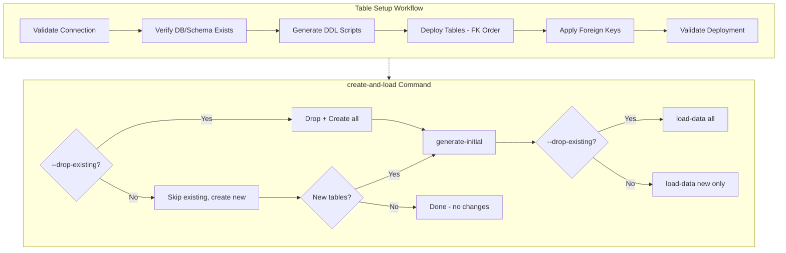

# Phase 7: Execution Workflows

## Objective

Create production-ready workflows integrating all modules for streamlined deployment.

## Architecture



## Key Files

| File | Purpose |
|------|---------|
| `src/workflows/base_workflow.py` | BaseWorkflow, WorkflowResult |
| `src/workflows/table_setup_workflow.py` | TableSetupWorkflow |
| `src/cli/commands/workflows.py` | CLI commands (setup-tables, create-and-load) |

## Workflow 1: Table Setup (One-time DDL)

**Purpose:** One-time setup to create all tables with proper FK dependencies

**Inputs:**

- Snowflake connection config (from env vars or config file)
- Target database, schema (must exist)
- Optional: `drop_existing=False` flag for recreation

**Outputs:**

- All 18 tables created in Snowflake
- All FK constraints applied (skips if already exist)
- Validation report

### CLI Usage

```bash
# Create all tables (first time)
dwh setup-tables

# Preview what would be created
dwh setup-tables --dry-run

# Recreate tables (drop existing first)
dwh setup-tables --drop-existing

# Skip foreign key constraints
dwh setup-tables --skip-fk
```

### Idempotent Behavior

- Tables that already exist are skipped with `⊘ Table 'xyz' already exists, skipping`
- FK constraints that already exist are skipped with `⊘ Foreign key 'xyz' already exists, skipping`
- Summary shows: `Tables: 3 created, 15 already existed`

### Implementation

```python
@dataclass
class TableSetupConfig:
    database: Optional[str] = None  # Uses env var if not provided
    schema: Optional[str] = None    # Uses env var if not provided
    drop_existing: bool = False
    dry_run: bool = False
    apply_foreign_keys: bool = True

class TableSetupWorkflow:
    def run(self, config: TableSetupConfig) -> WorkflowResult:
        # 1. Connect and validate
        # 2. Optionally drop existing tables
        # 3. Create tables (skip if exists)
        # 4. Apply FKs (skip if exists)
        # 5. Return summary
```

## Command: create-and-load

**Purpose:** Single command for deployment - fresh or incremental based on `--drop-existing` flag.

### Behavior

| Mode | Flag | Behavior |
|------|------|----------|
| Fresh | `--drop-existing` | Drop all → Create all → Generate all → Load all |
| Incremental | (default) | Skip existing → Create new → Generate all → Load new only |

### CLI Usage

```bash
# Fresh deployment (drop everything, recreate, load)
dwh create-and-load --drop-existing

# Incremental (add new tables only, existing untouched)
dwh create-and-load

# Override data volumes
dwh create-and-load --drop-existing --customers=1000 --products=5000 --orders=20000

# Only create tables, skip data
dwh create-and-load --skip-load

# Skip FK constraints
dwh create-and-load --skip-fk
```

### Options

| Option | Description |
|--------|-------------|
| `--drop-existing` | Fresh deployment: drop and recreate all tables |
| `--skip-fk` | Skip foreign key constraints |
| `--skip-load` | Only create tables, skip data generation and loading |
| `--customers` | Override number of customers (from config if not provided) |
| `--products` | Override number of products (from config if not provided) |
| `--orders` | Override number of orders (from config if not provided) |
| `--stores` | Override number of stores (from config if not provided) |
| `--employees` | Override number of employees (from config if not provided) |
| `--seed` | Override random seed (from config if not provided) |

### Data Configuration

Data volumes are read from `src/data_generators/datagen_config.yaml`:

```yaml
initial_load:
  customers: 500
  products: 5000
  stores: 10
  employees: 50
  sales: 10000
  # ... etc
```

CLI arguments override config values.

### How Incremental Mode Works

When `--drop-existing` is NOT specified:

1. `setup-tables` skips existing tables gracefully
2. Tracks newly created tables in `result.details["new_tables_created"]`
3. If no new tables: exits early ("no changes needed")
4. If new tables: generates ALL data (for referential integrity), loads ONLY new tables

```python
tables_success, result = setup_tables_command(return_result=True)
new_tables = result.details.get("new_tables_created", [])

for table_name in new_tables:
    load_data_command(table_name=table_name, truncate=True)  # Safe - new empty tables
```

## Incremental Data Loading (Existing Tables)

For adding new data to existing tables (not new tables), use the standard incremental commands:

```bash
# Generate incremental data
dwh generate-incremental --start-date 2026-02-01 --end-date 2026-02-28

# Load incremental data
dwh load-data --mode incremental
```

## Shared Components

### WorkflowResult

```python
@dataclass
class WorkflowResult:
    success: bool
    workflow_name: str
    started_at: datetime
    completed_at: datetime
    stages_completed: List[str]
    error: Optional[str] = None
    details: Dict[str, Any] = field(default_factory=dict)
    
    @property
    def duration_seconds(self) -> float:
        return (self.completed_at - self.started_at).total_seconds()
```

## Tests

- `tests/test_workflows.py` - 11 tests passing, 2 skipped (CLI tests)
- Tests WorkflowResult creation
- Tests TableSetupConfig defaults and custom values
- Tests dry-run mode
- Tests connection failure handling
- Tests backwards compatibility aliases
