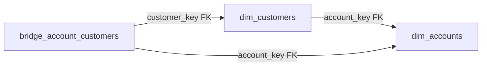

# Phase 9: Account Dimension

## Overview

Add `dim_accounts` dimension and `bridge_account_customers` bridge table to the star schema, wire them through the full stack (model, DDL, data generation, relationships, config), and update dim_customers with an `account_key` FK for simple join paths.

## Status: Complete

---

## Design

Two new tables, one modified table:

**dim_accounts** -- Account-level entity (organizations, households, individuals). No FK dependencies, so it's an independent dimension loaded in Tier 0.

| Column                | Type          | Notes                                                 |
| --------------------- | ------------- | ----------------------------------------------------- |
| account_key           | NUMBER(38)    | PK (surrogate)                                        |
| account_id            | VARCHAR(50)   | Business key                                          |
| account_name          | VARCHAR(200)  | NOT NULL                                              |
| account_type          | VARCHAR(50)   | Individual / Household / Business / Corporate / Guest |
| company_name          | VARCHAR(200)  | nullable, for B2B                                     |
| tax_id                | VARCHAR(50)   | nullable, tax exempt ID                               |
| tax_exempt_status     | BOOLEAN       | default FALSE                                         |
| billing_address_line1 | VARCHAR(500)  |                                                       |
| billing_address_line2 | VARCHAR(500)  |                                                       |
| billing_city          | VARCHAR(100)  |                                                       |
| billing_state         | VARCHAR(50)   |                                                       |
| billing_postal_code   | VARCHAR(20)   |                                                       |
| billing_country       | VARCHAR(100)  |                                                       |
| payment_terms         | VARCHAR(50)   | NET-30 / NET-60 / Due on Receipt / null               |
| credit_limit          | NUMBER(15,2)  | nullable                                              |
| account_status        | VARCHAR(50)   | Active / Suspended / Closed / Pending                 |
| account_tier          | VARCHAR(50)   | Standard / Premium / Enterprise / null                |
| registration_date     | DATE          | NOT NULL                                              |
| closure_date          | DATE          | nullable                                              |
| is_active             | BOOLEAN       | NOT NULL, default TRUE                                |
| created_at            | TIMESTAMP_NTZ | NOT NULL                                              |
| updated_at            | TIMESTAMP_NTZ | nullable                                              |

**bridge_account_customers** -- M:M link between accounts and customers with role context. Cluster on `[account_key, customer_key]`.

| Column               | Type          | Notes                                   |
| -------------------- | ------------- | --------------------------------------- |
| account_customer_key | NUMBER(38)    | PK                                      |
| account_key          | NUMBER(38)    | FK -> dim_accounts                      |
| customer_key         | NUMBER(38)    | FK -> dim_customers                     |
| role                 | VARCHAR(50)   | Owner / Admin / Buyer / Viewer / Member |
| is_primary_contact   | BOOLEAN       | default FALSE                           |
| effective_date       | DATE          | NOT NULL                                |
| end_date             | DATE          | nullable                                |
| is_current           | BOOLEAN       | default TRUE                            |
| created_at           | TIMESTAMP_NTZ | NOT NULL                                |

**dim_customers modification** -- Added `account_key NUMBER(38)` FK column pointing to `dim_accounts.account_key`. This gives a simple 1:M join path for the common case (primary account), while the bridge handles multi-account scenarios.

---

## Load Order Impact

- `dim_accounts` slots into Tier 0 (static/independent dimensions, no FK deps)
- `dim_customers` already in Tier 1, now also depends on `dim_accounts`
- `bridge_account_customers` goes into Tier 3 (bridge tables), after both dims are loaded

---

## Deliverables

- [x] `src/models/dimension_tables/dim_accounts.py` -- Table model
- [x] `src/models/bridge_tables/bridge_account_customers.py` -- Bridge model
- [x] `src/data_generators/entities/dim_accounts.py` -- Entity generator
- [x] `src/data_generators/entities/bridge_account_customers.py` -- Bridge generator
- [x] `src/models/dimension_tables/dim_customers.py` -- Added `account_key` column + FK
- [x] `src/sql_generator/schema_manager.py` -- Registered both new tables
- [x] `src/data_generators/relationships.py` -- Added FK tuples and load order entries
- [x] `src/data_generators/config.py` -- Added `accounts` to VolumesConfig and parser
- [x] `datagen_config.yaml` (project root) -- Added `accounts: 200` default
- [x] `src/data_generators/helpers/sales_helper.py` -- Wired account + bridge generation
- [x] `src/data_generators/entities/dim_customers.py` -- Accepts and assigns `account_keys`
- [x] `plans/PLAN.md`, `CLAUDE.md`, `REFERENCE.md`, `SKILL.md` -- Updated to 20 tables
- [x] `tests/test_dim_accounts.py` -- 34 tests (models, generators, referential integrity)

---

## Data Generation Logic

- **dim_accounts**: Generate ~200 accounts for 500 customers (~2.5 customers/account average). Mix of types: 60% Individual, 15% Household, 15% Business, 8% Corporate, 2% Guest. Business/Corporate accounts get company_name, tax_id, credit_limit, payment_terms.
- **dim_customers**: Each customer gets assigned a primary `account_key`. Individual accounts map 1:1. Household/Business/Corporate accounts get 2-10 customers.
- **bridge_account_customers**: One row per customer-account link. Primary account relationship from dim_customers is mirrored here with `is_primary_contact=TRUE` + role assignment.

---

## Testing

34 tests in `tests/test_dim_accounts.py`:

- Model validation for both new tables (column counts, PKs, FKs, cluster keys)
- dim_customers account_key column and FK presence
- Data generator produces correct counts, columns, and account types
- B2B accounts have company_name; Individual accounts do not
- Bridge first-customer-per-account is Owner with is_primary_contact=TRUE
- Referential integrity: bridge references valid account_key and customer_key
- Edge cases: zero count, no account_keys passed
